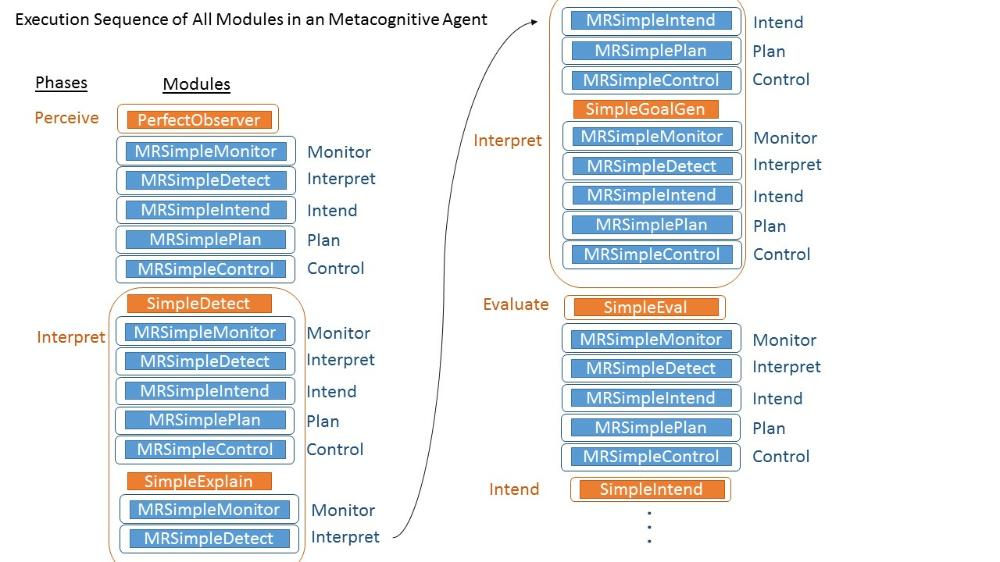

|image0|\ |image1|

**MIDCA, Version 1.4**

User Manual and Tutorial for the Metacognitive Integrated Dual-Cycle
Architecture

Technical Report Number COLAB\ :sup:`2`-TR-3

Dustin Dannenhauer\ :sup:`1`, Danielle Brown, Samuel Schmitz, Vahid
Eyorokon, Venkatsampath R. Gogineni, Sravya Kondrakunta, Zohreh A.
Dannenhauer and Michael T. Cox\ :sup:`2`

**Wright State University**

*College of Engineering & Computer Science*

*Department of Computer Science and Engineering*

*3640 Col. Glenn Hwy.*

*Dayton, OH 45435*

============================ =========================================
:sup:`1`\ Navatek            :sup:`2`\ Wright State Research Institute
                            
*4300 Wilson Blvd Suite 350* *4035 Col. Glenn Hwy.*
                            
*Arlington, VA 22203*        *Beavercreek, OH 45431*
============================ =========================================

**Quick Start**

This section describes how to install the core MIDCA system and shows
how to run a very simple example that illustrates fundamental execution
within the architecture. These instructions do not describe the full
installation. See Installing MIDCA on page 24 instead. For more details
on the example, see Section 2.2 page 5.

*Installing MIDCA*

1. Obtain a copy of MIDCA by cloning the repository or downloading the
   source directory (https://github.com/COLAB2/midca).

2. Make sure the name of the top level folder is spelled exactly
   ‘midca’. If midca has been downloaded as a zip file, you will have to
   rename it because it saves the folder as 'midca-master'.

3. Run the command python setup.py install.

   -  If you plan to make changes to MIDCA, run python setup.py develop
      instead. Any changes you make will be immediately updated when you
      run MIDCA.

   -  Note that NumPy (`http://www.numpy.org <http://www.numpy.org/>`__)
      should be installed automatically when you run python setup.py
      install (or with the ‘develop’ option). If for any reason that
      fails, you will need to install the package yourself. You can
      check that NumPy is installed by running python and typing import
      numpy.

*Example: The Running of the Chickens*

The chicken_run.py script runs a simple version of MIDCA in a domain
where chickens can cross a road. The state of the environment (i.e., the
world) consists of a left and right side of the road. The possible goal
predicates are “onleft” and “onright” and the possible goal arguments
are “clucky” and “lady cluck”, which refer to two chickens. The goal
predicates dictate which side of the road the selected argument (i.e.,
chicken) will try to reach. For example, if “onleft(clucky)” was
selected as the goal, then the executed plan for this goal would result
in the chicken named clucky being on the left side of the road after the
goal is completed.

Instructions for running the example.

1. Open up a command line in a terminal.

2. Go to midca/midca/examples directory.

   -  cd midca/midca/examples

3. Run chicken_run.py.

   -  python chicken_run.py

..

   Press ? and enter for help. Or just pressing <enter> will advance one
   phase.

-  You will see the following:

..

   Next MIDCA command:

   \*****\* Starting Simulate Phase \*****\*

   Simulator: no actions selected yet by MIDCA.

   Next MIDCA command:

4. Press enter to continue to the next step (in MIDCA, steps are called
   “phases”).

   -  You will see the following

..

   \*****\* Starting Perceive Phase \*****\*

   World observed.

   Next MIDCA command:

-  Typing show displays Clucky on the right and lady clucky on the left.

..

   Once at the Interpret phase

-  You will see the following:

..

   \*****\* Starting Interpret Phase \*****\*

   Please input a goal if desired. Otherwise, press enter to continue

-  Now enter a goal: onleft(clucky).

5. You will see the plan and its remaining execution if you continue to
   press enter repeatedly.

6. To exit the script, type q and hit enter.

*Runtime Commands*

The following interactive commands are useful when MIDCA pauses
execution (see the section Runtime Commands on page 26 for a full list).

1. **help (or ‘?’).** Displays the possible commands that can be given
   to MIDCA during runtime (i.e. the commands detailed here).

2. **memorydump.** Allows user to see memory variables. The user can
   either see all variables and their values or enter a single variable
   name and just see its value. If MIDCA has been running a long time,
   the output may take up more than the screen, therefore just looking
   for the variable can save space.

3. **printtrace.** Outputs a text representation of the entire trace up
   until the last phase executed by MIDCA.

4. **q.** Quits MIDCA.

5. **show.** Displays the current state of the world.

6. **skip (&\ optional x=1).** Skips ahead x number of cycles or one
   full cycle if x is not given.

Table of Contents

`Quick Start ii <#_Toc22807962>`__

`Table of Contents iv <#_Toc40875712>`__

`Table of Figures vi <#_Toc22807964>`__

`1. Introduction 1 <#introduction>`__

`1.1. MIDCA, Version 1.4 1 <#midca-version-1.4>`__

`1.2. How to Get Help 1 <#how-to-get-help>`__

`1.3. Outline 2 <#outline>`__

`2. MIDCA Overview 2 <#midca-overview>`__

`2.1. The Ground Level, Object Level and Meta-level
2 <#the-ground-level-object-level-and-meta-level>`__

`2.2. The MIDCA Phase Structure 4 <#the-midca-phase-structure>`__

`The cognitive cycle 4 <#the-cognitive-cycle>`__

`The chicken_run example 5 <#the-chicken_run-example>`__

`The metacognitive cycle 5 <#the-metacognitive-cycle>`__

`3. Planning 7 <#planning>`__

`3.1. The Blocksworld Domain 8 <#the-blocksworld-domain>`__

`3.2. MIDCA’s Planners 8 <#midcas-planners>`__

`3.3. Examples of Planning Operators and Methods
9 <#examples-of-planning-operators-and-methods>`__

`Pyhop planner 9 <#pyhop-planner>`__

`JSHOP planner 9 <#jshop-planner>`__

`3.4. How to Run an Example in MIDCA_1.4
10 <#how-to-run-an-example-in-midca_1.4>`__

`Blocksworld domain with Pyhop planner
10 <#blocksworld-domain-with-pyhop-planner>`__

`Blocksworld domain with JSHOP Planner
11 <#blocksworld-domain-with-jshop-planner>`__

`4. Interpretation 12 <#interpretation>`__

`4.1. D-Track Goal Generation 12 <#d-track-goal-generation>`__

`4.2. K-Track Goal Generation 14 <#k-track-goal-generation>`__

`5. The Implementation of MIDCA, Version 1.4
16 <#the-implementation-of-midca-version-1.4>`__

`5.1. Phases and Modules in MIDCA. 16 <#phases-and-modules-in-midca.>`__

`5.2. Adding a New Module 18 <#adding-a-new-module>`__

`5.3. The Goal Graph and Examples 18 <#the-goal-graph-and-examples>`__

`Example with a plan that fails to achieve all goals
20 <#example-with-a-plan-that-fails-to-achieve-all-goals>`__

`Examples of goal graph drawings
21 <#examples-of-goal-graph-drawings>`__

`5.4. Goal Operations 22 <#_Toc40875742>`__

`5.5. How to Install and Run Version 1.4 of the MIDCA Architecture
24 <#how-to-install-and-run-version-1.4-of-the-midca-architecture>`__

`Installing MIDCA 24 <#installing-midca>`__

`Using MIDCA with simulated worlds using a predicate representation
24 <#using-midca-with-simulated-worlds-using-a-predicate-representation>`__

`Running MIDCA 25 <#running-midca>`__

`Understanding how MIDCA works from browsing the source code
26 <#understanding-how-midca-works-from-browsing-the-source-code>`__

`6. Defining a New Domain 27 <#defining-a-new-domain>`__

`7. Logging and Debugging in MIDCA_1.4
29 <#logging-and-debugging-in-midca_1.4>`__

`7.1. Logging 29 <#logging>`__

`Initiating and disabling a log file
29 <#initiating-and-disabling-a-log-file>`__

`Location of log files 29 <#location-of-log-files>`__

`Files in the log folder: 29 <#files-in-the-log-folder>`__

`7.2. Debugging 30 <#debugging>`__

`Debugging in MIDCA_1.4 30 <#debugging-in-midca_1.4>`__

`Debugging through log files 30 <#debugging-through-log-files>`__

`8. Advanced Features 31 <#advanced-features>`__

`8.1. The MIDCA_1.4 API to ROS 31 <#the-midca_1.4-api-to-ros>`__

`8.2. Using the MIDCA API to ROS for the Baxter Humanoid Robot
33 <#using-the-midca-api-to-ros-for-the-baxter-humanoid-robot>`__

`Blocksworld domain for the Baxter
33 <#blocksworld-domain-for-the-baxter>`__

`ROS topics 33 <#ros-topics>`__

`External steps (sensors and effectors)
33 <#external-steps-sensors-and-effectors>`__

`MIDCA setup: all steps from baxter_run.py.
34 <#midca-setup-all-steps-from-baxter_run.py.>`__

`What MIDCA does while running 34 <#what-midca-does-while-running>`__

`Camera calibration. 36 <#camera-calibration.>`__

`8.3. The Baxter and Gazebo 37 <#the-baxter-and-gazebo>`__

`Acknowledgements 40 <#_Toc525121013>`__

`References 41 <#_Toc22808018>`__

`Appendix A: Frequently Asked Questions 43 <#_Toc22808019>`__

`MIDCA_1.4 General Questions 43 <#midca_1.4-general-questions>`__

`Questions regarding ROS and the Baxter robot 44 <#_Toc40875771>`__

`Appendix B: List of Modules 45 <#_Toc22808022>`__

Table of Figures

`Figure 1. The Metacognitive Integrated Dual-Cycle Architecture (MIDCA)
3 <file:///C:\Users\michael.cox\Google%20Drive\Research\MIDCA\MIDCA%20documentation\MIDCA%20Doc_9_4.docx#_Toc12944873>`__

`Figure 2. An example of task decomposition. 7 <#_Ref526512331>`__

`Figure 3. A blocksworld problem to put block A on B.
8 <#_Ref12531479>`__

`Figure 4. A task decomposition tree for goal in blocksworld domain.
8 <#_Ref12531503>`__

`Figure 5. MIDCA_1.4 output during the cogsci_demo example.
11 <#_Ref12365778>`__

`Figure 6. Depiction of the TF-Tree used in cycling through the 3 block
configurations. 13 <#_Ref12531597>`__

`Figure 7. TF-Tree that generates goals to put out fires.
14 <#_Ref12531733>`__

`Figure 8. Module execution sequences
17 <file:///C:\Users\michael.cox\Google%20Drive\Research\MIDCA\MIDCA%20documentation\MIDCA%20Doc_9_4.docx#_Toc12944880>`__

`Figure 9. Example showing interleaving of metacognitive modules
17 <#_Ref526157463>`__

`Figure 10. Complete sequence of all modules in the order they are
executed 18 <#_Ref526157473>`__

`Figure 11. Goal graph for Example 1. 22 <#_Toc12944883>`__

`Figure 12. Goal graph for Example 2.
22 <file:///C:\Users\michael.cox\Google%20Drive\Research\MIDCA\MIDCA%20documentation\MIDCA%20Doc_9_4.docx#_Toc12944884>`__

`Figure 13. Example specification of the MIDCA_1.4 log file.
29 <#_Ref526157616>`__

`Figure 14. Code snippet of a log file. 29 <#_Ref526157638>`__

`Figure 15. Code snippet of memory access file. 30 <#_Ref526157659>`__

`Figure 16. Code snippet of the MIDCA_1.4 output file.
30 <#_Ref526157677>`__

`Figure 17. Interfaces between MIDCA and the external world and between
cognition and metacognition. 31 <#_Ref12910074>`__

`Figure 18. Baxter Robot in gazebo, after executing the roslaunch
command.
38 <file:///C:\Users\michael.cox\Google%20Drive\Research\MIDCA\MIDCA%20documentation\MIDCA%20Doc_9_4.docx#_Toc12944890>`__

`Figure 19. Baxter Robot along with table and blocks in gazebo, after
executing the second set of commands.
38 <file:///C:\Users\michael.cox\Google%20Drive\Research\MIDCA\MIDCA%20documentation\MIDCA%20Doc_9_4.docx#_Toc12944892>`__

`Figure 20. Baxter Robot with left arm in tucked position and right arm
in a position to view blocks, after executing the third set of commands.
39 <file:///C:\Users\michael.cox\Google%20Drive\Research\MIDCA\MIDCA%20documentation\MIDCA%20Doc_9_4.docx#_Toc12944894>`__

Introduction
============

The *Metacognitive Integrated Dual-Cycle Architecture* *(MIDCA)* (Cox et
al., 2016; Paisner, Cox, Maynord & Perlis, 2014), is a cognitive
architecture that models both cognition and metacognition for
intelligent agents. It consists of “action-perception” cycles at both
the cognitive level and the metacognitive level. In general, a cycle
performs problem-solving to achieve its goals and tries to comprehend
the resulting actions and those of other agents. Problem solving
consists of intention, planning, and action execution phases, whereas
comprehension consists of perception, interpretation, and goal
evaluation.

The MIDCA system is meant to serve as a basis for intelligent control of
a software agent or physical platform in a complex environment. MIDCA
can be applied to several different environments (i.e. domains) and can
be used for various decision tasks. People interested in using MIDCA are
likely to fall into two categories.

1. People who want to build an agent to carry out tasks in an
   environment.

2. People who want to build upon MIDCA as they conduct new research on
   cognitive architectures and artificial intelligence.

Regardless of category, if this is your first time using MIDCA, begin
with the “Quick Start” section preceding the Table of Contents of this
manual (pp. ii-iii).

MIDCA, Version 1.4
------------------

MIDCA is a computational theory of cognition and metacognition
implemented in a software system written mainly in python. MIDCA is
highly extensible and can be easily tailored for custom use as will be
explained in this manual. Version 1.4 of MIDCA (i.e., MIDCA_1.4) is
publicly available on the GitHub code repository and has several new
features including the following.

1. JShop automated planner.

2. Goal selection operation.

3. Goal change operation.

4. Expectations and explanation module at the meta-level.

5. New domains.

Project website: `www.midca-arch.org <http://www.midca-arch.org>`__

GitHub repository: https://github.com/COLAB2/midca

GitHub wiki: https://github.com/COLAB2/midca/wiki/MIDCA-v1.4-Home

How to Get Help
---------------

Questions and comments with respect to MIDCA_1.4 are welcome. Please
email your concerns to wsri-midca-help@wright.edu. Resources and videos
are also available from the site of the Annual MIDCA Workshops. See
`www.midca-arch.org/workshops <http://www.midca-arch.org/workshops>`__.

Outline
-------

The remainder of this document is organized as follows. First, we
present an overview of the MIDCA architecture. In this section, we
distinguish metacognition from cognition, and then we discuss the
system’s organization in terms of information processing phases. The
next section describes the implementation of phases as python modules
and details how to add custom modules. This is followed by a description
of the goal graph data structure along with an example. The next section
describes how to define a new domain, and we discuss the fundamental
notion of goal operations in MIDCA that distinguishes it from similar
cognitive systems. This is followed by a section that explains logging
and debugging within the architecture. A subsequent section on advanced
features includes details for using MIDCA_1.4 with the *Robot Operating
System (ROS)* framework. Finally, this document concludes with
references and two appendices. Appendix A contains frequently asked
questions and Appendix B enumerates the full list of the basic system
modules.

 MIDCA Overview
==============

MIDCA’s functional structure is depicted in Figure 1. This illustration
shows the architecture’s two reasoning cycles and their constituents.
MIDCA’s cycles are organized into functional phases at different levels,
and the phases are implemented by python modules. This section describes
the former, and the next section deals with the latter.

A reasoning cycle starts with input of the domain (either the world
domain or cognition itself) via the Perceive (or Monitor) phase. The
Interpret phase takes the extracted predicate relations and the
expectations in memory in order to determine whether the agent is making
sufficient progress. At this point, if the domain presents problems or
opportunities for the agent, then a new goal is created. The Evaluate
phase incorporates the concepts inferred from Interpret and notes
whether existing goals are achieved. In a cycle, Intend commits to a
current goal from those available. The Plan phase then generates a
sequence of actions. The Act (or Control) phase executes the plan one
step at a time to change the domain through the effects of the planned
actions. In the next cycle, MIDCA will then use expectations from a
model of these actions to evaluate the execution of the plan. The
metacognitive cycle (in Figure 1, upper cycle in blue) is analogous to
the cognitive cycle (lower cycle in orange).

The Ground Level, Object Level and Meta-level
---------------------------------------------

One way of organizing MIDCA’s capabilities is to describe them in terms
of three levels: (1) the ground level; (2) the object level; and (3) the
meta-level (Cox & Raja, 2011). The *ground level* contains the Perceive
phase, Act phase, and the world simulator (or when using MIDCA with ROS
or another API, the world itself) and focuses on interactions with
MIDCA’s environment. This level contains the information needed for the
agent to acquire observations from the world (Perceive) and perform
changes to the world (Act). Perceive and Act phases may need to be
customized based on the environment or world the agent is operating
within.

|image2|\ The *object level*, which is sometimes referred to as the
cognitive level, contains phases that use information directly related
to the world. These are non-metacognitive phases. The Plan, Intend,
Evaluate, and Interpret phases are all part of the object level, since
they are each concerned with world-related information. The Plan phase
determines what actions need to be executed in the world to achieve the
goal. The Intend phase selects which goals to commit to; these goals are
future world states the agent would like to achieve. The Evaluate phase
assesses the completion of active goals. The Interpret phase is
concerned with detecting anomalies, explaining failures (in the world),
and generating new goals. Within the phases of the object level,
activity is generally related to the environment. Goals are concrete or
abstract world states to be achieved.

The *meta-level* is concerned with monitoring and controlling the object
level. In the same way the object level perceives the environment and
acts to change it, so does the metacognitive level monitor the object
level and act, via the meta-level control phase, to change the object
level. The structure of the phases at the meta-level mirror the object
level, yet the focus of the phases is different. The source of input to
the meta-level (through the Monitor phase) is a trace of behavior of the
object level. Note that the meta-level is still in early development and
so the implementation is preliminary.

The MIDCA Phase Structure 
--------------------------

The fundamental computational unit for reasoning cycles in MIDCA is an
information processing phase.

The cognitive cycle 
~~~~~~~~~~~~~~~~~~~~

**Perceive:** The objective of the Perceive phase is to obtain knowledge
of the world. If using a simulator, this may be to simply query the
simulator for a current state and then store that state in MIDCA’s
memory. If not using a simulator, other capabilities may be required
such as instructing a physical camera to capture photos or videos of the
agent’s environment (see Section 8.2 for an example of this). In
general, all observations should happen in the Perceive phase.

**Interpret:** The Interpret phase directly follows Perceive and is
meant to provide a number of interpretation-related capabilities. These
capabilities derive useful information from an initial world state which
is obtained from the Perceive phase. These capabilities are likely to
include but are not limited to: inferring new facts (e.g. by running a
reasoner over the initial world state), noting any anomalies or
unexpected conditions in the world state, explaining why the world state
is the way that it is or why an anomaly has occurred, and generating new
goals for MIDCA to pursue. Prior research on goal formulation has shown
that certain states may prompt the agent to adopt new goals (Paisner,
Cox, Maynord, & Perlis, 2014).

**Evaluate:** Evaluate follows from the Interpret phase and the primary
focus is to review and update the agent’s current goals. Most
importantly, if the agent has achieved a goal, then the goal should be
dropped in the Evaluate phase. In general, any kind of behavior
involving evaluation of the agent’s knowledge should happen in this
phase.

**Intend:** The Intend phase determines which goals to pursue and
follows after the Evaluate phase. New goals are typically generated and
inserted into MIDCA’s goal graph (the goal graph is the system’s
internal structure for its goals and plans; see Section 5.3)\ *.* During
the Intend phase, MIDCA may commit to 1 or more goals. There are two
selection strategies used to select one goal from all available goals.
The first method is First In First Out (FIFO) and the second is a smart
selection criterion to select a goal. For more information on the
latter, see Kondrakunta (2017).

**Plan:** The primary purpose of the Plan phase, which follows the
Intend phase, is to generate the next actions to be executed by MIDCA.
The current goals and state of the world stored in MIDCA’s memory are
used as input. There are multiple planners that are available in MIDCA
including a *Hierarchical Task Network (HTN)* Python-based SHOP planner
named Pyhop; an asynchronous version of Pyhop that is more commonly used
on robotics platforms (we have used it on a Baxter robot); a java-based
HTN SHOP2 planner (Nau, et al., 2003; Nau, Muñoz-Avila, Cao, Lotem, &
Mitchell, 2001) that is run as an external java program; and a
state-space heuristic search planner that can be modified to be used as
a BFS, DFS, or A\* planner. Because planning often requires specific
knowledge (i.e., HTN planners require task and method decompositions;
heuristic search planners may require domain-specific heuristics), there
are special files that contains planner specific information (see
Section 3.3).

**Act:** The Act phase carries out the next action by MIDCA, usually the
next action of the current plan. If no plan exists, then no actions are
performed. If an action is chosen, it is sent to the world simulator,
which uses it to compute the next world state. An example of such an
action might be crossleft() in the chicken domain below. Any behavior
where MIDCA executes an action to change the world happens in this
phase. For an example of the Act phase operating on a robot, see Section
8.2.

The chicken_run example
~~~~~~~~~~~~~~~~~~~~~~~

Chicken_run.py is a cognition-only example in MIDCA which demonstrate
the basics of MIDCA 1.4. This section will go through the
cognitive-level phases of MIDCA in the example and explain each phase.
See also the Quick Start on pages ii-iii.

**Perceive:** In the beginning of this example, Perceive does little
more than copy the state of the world (i.e., the chicken and the road)
and put it back in memory.

**Interpret:** This phase interacts with the user. It waits for a goal
predicate to be given. For example, the user could give the goal
“onleft(clucky)”. This establishes the goal agenda for MIDCA as the
single goal for the chicken to cross to the left side of the road.

**Evaluate:** This phase checks to see if the current goal is achieved
in the state. Because the goal in the agenda has not yet been committed
to, this phase does nothing.

**Intend:** This phase now selects the most recent goal from the agenda
and makes it the current goal, thereby committing to achieve this goal

**Plan:** This phase creates a plan with actions that will allow a goal
to be accomplished. For example, if the user wants the chicken to cross
to the left side of the road, MIDCA might create a plan with a single
action “crossleft”.

**Act:** This phase takes an action from the plan and attempts to
execute it.

**Simulation:** The action is now simulated and the results of the
action changes the state of the world if the action was valid.

**Perceive:** This phase takes the new state from the simulator and
updates the memory. For example, if the chicken has crossed to the left
side of the road it will appear in the world on the left side of the
road. This perceive marks the beginning of the second cycle through the
cognitive level.

**Interpret:** Nothing occurs during Interpret at this point in the
example. If something unexpected had happened (i.e., the “crossleft”
action had failed), a new goal may have been generated.

**Evaluate:** This phase notices that the state of the world entails the
goal state and removes the “onleft(clucky)” goal from the agenda. The
agenda is now empty.

The metacognitive cycle
~~~~~~~~~~~~~~~~~~~~~~~

Metacognitive phases carry the same philosophy as their cognitive-level
counterparts. The primary differences are between Perceive (cognitive)
and Monitor (metacognitive), and between Act (cognitive) and Control
(metacognitive). Perceive and Monitor are both concerned with obtaining
the state of the “world.” However, the world for the Monitor phase is
not the ground-level world, but instead it is the “world” of cognition.
Thus, Monitor obtains information pertaining to activity at the
cognitive level. Likewise, the cognitive level Act phase is concerned
with actions that change the ground-level environment while the
meta-level Control phase is concerned with modifying some part of
cognition. This could include changing data stored in MIDCAs memory or
removing or adding a module from a particular cognitive phase. Below is
a brief summary of each phase of the metacognitive layer. Please keep in
mind that the metacognitive layer is still in early development and some
phases have no implementation other than a simple, hand-engineered
approach. There are many opportunities for future work at the
metacognitive level.

**Monitor:** The Monitor phase obtains the most recent s of cognition
from memory. The cognitive trace is constructed by recording what each
module in each phase takes as an input and produces as an output.
Specifically, the cognitive trace is composed of an ordered dictionary
that can be indexed via the phase and cycle (cycle refers to loop
iterations). The inputs and outputs are changes in the data stored in
MIDCA’s memory. For example, an input to the module performing planning
during the Plan phase would be the world state and current goal of MIDCA
(again these are stored in MIDCA’s memory) and the output would be a
plan (which is also stored in MIDCA’s memory).

**Interpret:** The Interpret phase is responsible for detecting
cognitive-level behavior that may warrant a metacognitive response.
Currently, Interpret has modules for detecting discrepancies, explaining
the cause, and generating an appropriate goal. However, only discrepancy
detection is implemented; explanation and goal generation are simple,
hand-engineered approaches. Currently there are two ground-level
domain-independent expectations that are used in the discrepancy
detection approach found in the *MRSimpleDetect* module.

**Evaluate:** Since the current implementation of the metacognitive
layer ensures that all metacognitive goals are achieved in one
metacognitive cycle, Evaluate does not have an implementation. Evaluate
will be responsible for monitoring progress on metacognitive goals that
take more than a cycle to achieve. The metacognitive layer runs for only
a single loop between each cognitive module; see Figure 8, Figure 13,
and Figure 10).

**Intend:** The Intend phase is meant to decide which goal to pursue.
The current implementation is straightforward, and any goals that are
pending will be selected.

**Plan:** The Plan phase decides what actions to take in order to
achieve a metacognitive goal (which is different than a cognitive goal,
since a metacognitive goal is concerned with a future ‘mental state’ in
cognition; goals at the metacognitive layer are another area of future
work). Right now the Control phase can only execute three actions:
*RemoveModule, AddModule,* and *TransformGoal.* The *RemoveModule* and
*AddModule* actions are responsible for removing and adding cognitive
level modules, respectively. The *TransformGoal* action is responsible
for performing a transformation on the goal. The code to carry-out these
actions are found in the Control Phase.

**Control:** The Control phase contains the information for carrying out
the actions described in Plan. Currently, the Control phase carries out
an entire plan as opposed to a single action like the Act (cognitive)
phase.

We now turn our attention to a more detailed discussion of the
components that make up MIDCA’s phases. Most important are the planning
and interpretation components. We examine them in turn.

Planning
========

In the literature, planning is a means for calculating a sequence of
steps that achieve a goal or perform a task, given the current
configuration of the world. Steps are represented as actions that if
executed will change the world; whereas the configuration of the world
is represented as a state consisting of the relationships between
objects that are true at some point in time. These relationships are
often represented as a set of logical predicates along with their
arguments. For example, :math:`S = \{ p(a,b)\}` is a state where the
predicate :math:`p` holds between the objects :math:`a` and :math:`b`.
State-space planners seek to achieve a goal state given an initial
state; whereas *hierarchical task network (HTN)* planners seek to refine
an abstract task into a set of subtasks given an initial state. Both
produce as output an ordered sequence of actions we call a plan. Given
that MIDCA mainly uses HTN planners, we will assume this for the
subsequent discussion.

We denote an action
:math:`\alpha = \left( \text{name}\left( \alpha \right),\ precond\left( \alpha \right),\ effects\left( \alpha \right) \right)`
that accomplishes a primitive task :math:`t` in state :math:`s` if
:math:`(name(\alpha) = t\ `\ and is applicable to :math:`s`. A method is
a tuple :math:`m = (name(m),\ task(m),\ precond(m),\ subtasks(m))` in
which :math:`name(m)` is the name of the method; :math:`task(m)` is a
non-primitive task; and :math:`precond(m)` is a set of literals called
the method's preconditions. :math:`Precond(m)` specifies what conditions
the current state must satisfy in order for :math:`m` to be applied, and
:math:`subtasks(m)` specifies one or more subtasks to perform in order
to accomplish :math:`task(m)`.

|https://lh3.googleusercontent.com/BAZg2miJ1V9nVQx7G-GAEca7zYksPRGnQhIA5O88c9TnC9u5MvzLPNHbw3OjmZF4lCmcwS3cm4_luAsind0OJ-jS-HhynGRc7jHKA-JYr7YfepdwgiyEAhuexF468HIHNGt22UAD|

Figure 2. An example of task decomposition. Method m2 decomposes the
non-primitive task t12 into t21 and t22. Operators op1 and op2
accomplish each of these primitive subtasks respectively.

An HTN planning problem is a tuple :math:`P = (s,\ T,\ D)`. It takes the
initial state, :math:`s`, which is a symbolic representation of the
state of world, and a set of tasks
:math:`T = \langle t_{1},...,\ t_{k}\rangle`\ to be accomplished. It
also takes a knowledge base, :math:`D`, including operators and methods.
A plan :math:`\langle\pi = \alpha_{1},...,\ \alpha_{n}\rangle`\ is a
solution (i.e., a task decomposition as in Figure 2) for a planning
problem to accomplish :math:`T`. This means that there is a way to
decompose :math:`T` into π in such a way that π is executable in
:math:`s`, and upon execution will transform the start state into the
goal state.  

The Blocksworld Domain
----------------------

Consider an example in the blocksworld domain with a goal
:math:`on(A,\ B)`. This goal is mapped to the root task **move-blocks**
in Pyhop planner. Assume the initial state in panel (a) of Figure 3 with
the three blocks A, B, and C on the table. Given that both blocks are
clear, the planner generates a simple two-step plan
:math:`\pi = pickup(A),\ stack(A,B)`. Panels (b) and (c) show the
execution of the plan steps. Figure 4 shows the task decomposition tree
for this task.

|https://docs.google.com/drawings/d/slft4SkRCxZJ-3zt8tKT_Dw/image?w=562&h=113&rev=57&ac=1&parent=1kZry4t-wseUoCM0e-OG17uEZvvUyecqH0h9pN4jEtYs|

Figure 3. A blocksworld problem to put block A on B. The first panel
shows the initial state, and the remaining panels show the incremental
execution of the plan steps that solve the problem.

|https://docs.google.com/drawings/d/s7wAg1vCCijCc_ap0R6YieA/image?w=564&h=265&rev=334&ac=1&parent=1kZry4t-wseUoCM0e-OG17uEZvvUyecqH0h9pN4jEtYs|

Figure 4. A task decomposition tree for goal
:math:`\mathbf{\text{on}}\mathbf{(}\mathbf{A}\mathbf{,\ }\mathbf{B}\mathbf{)}`
in blocksworld domain. The leaves are the operators.

MIDCA’s Planners
----------------

SHOP (Nau, et al., 2003; Nau, Cao, Lotem & Muñoz-Avila, 1999) is an
*HTN* planning algorithm that generates plans for tasks rather than
goals. A procedure in MIDCA maps the goals to tasks for the SHOP
Planner. SHOP creates plans by recursively decomposing tasks into
smaller subtasks until only the primitive tasks are left which can be
accomplished directly. SHOP uses methods and operators. A method
specifies a way to decompose a non-primitive task into a set of subtasks
while an operator specifies a way to perform a primitive task.

MIDCA_1.4 uses two different implementations of the SHOP planner:

1 - Pyhop planner

2 - JSHOP planner

Pyhop is a SHOP-like planner (www.cs.umd.edu/projects/shop) written in
Python; whereas, JSHOP is the Java implementation of the SHOP planner.
For both planners, we need to define a domain file and a problem file
for the JSHOP planner. The domain file contains the definition of
operators, methods and axioms. In the problem file, initial state and
initial task list (goals) are specified.

Examples of Planning Operators and Methods
------------------------------------------

Pyhop planner
~~~~~~~~~~~~~

For each domain, there is an operator class and method class. For
example, the operators and methods for blocksworld domain are in
`midca <https://github.com/COLAB2/midca>`__/`midca <https://github.com/COLAB2/midca/tree/master/midca>`__/`domains <https://github.com/COLAB2/midca/tree/master/midca/domains>`__/`blocksworld <https://github.com/COLAB2/midca/tree/master/midca/domains/blocksworld>`__/`plan <https://github.com/COLAB2/midca/tree/master/midca/domains/blocksworld/plan>`__/.

The code below is an example of an operator in Pyhop. This is an
operator to *pickup* a block from the table. The preconditions of this
operator are (1) the position of the block is on the table, (2) the
block is clear, and (3) the agent is not holding anything.  The results
of this operator are (1) the block is in the hand, (2) the block is not
clear, and (3) the agent is holding the block.

1. **def** pickup(state,b):  

2.   **if** state.pos[b] == 'table' **and** state.clear[b] == True **and** state.holding == False:

3.     state.pos[b] = 'hand'  

4.     state.clear[b] = False  

5.     state.holding = b  

6.     **return** state  

7.   **else**: **return** False  

The code below is an example of a method in Pyhop. This method
decomposes the high level task move_one to a set of subtasks to get a
block :math:`b_{1}` and put it at destination. There are two different
ways to decompose this task. If the position of the block :math:`b_{1}`
is in arm, then this task is decomposed
to\ :math:`\langle(put,\ b_{1},\ dest)\rangle`, otherwise it is
decomposed to the set of
subtasks\ :math:`\langle(get,\ b_{1}),\ (put,\ b_{1},\ dest)\rangle`.

1. pyhop.declare_methods('move_one',move1)  

2.   

3. **def** move1(state,b1,dest):  

4.   **if** state.pos[b1] == "in-arm":  

5.     **return** [('put', b1,dest)]  

6.   **else**:  

7.     **return** [('get', b1), ('put', b1,dest)]  

JSHOP planner
~~~~~~~~~~~~~

The domain and state files for the blocksworld domain are located at the
URL
`midca <https://github.com/COLAB2/midca>`__\ /\ `midca <https://github.com/COLAB2/midca/tree/master/midca>`__\ /\ `domains <https://github.com/COLAB2/midca/tree/master/midca/domains>`__\ /\ `jshop_domains <https://github.com/COLAB2/midca/tree/master/midca/domains/jshop_domains>`__\ /\ `blocks_world <https://github.com/COLAB2/midca/tree/master/midca/domains/jshop_domains/blocks_world>`__.

The code below is an example of an operator in JSHOP planner.  The first
line is the name of the operator. The second line specifies the
preconditions that need to be met for that operator to be applied, and
the last line is the results of performing that operator.

1. (:operator (!pickup ?a)  

2.   ((clear ?a) (on-table ?a))  

3.   ((holding ?a)))  

The code below is an example of a method in JSHOP planner. The first
line is the name of the method, the second line (which is empty here) is
preconditions for this method, and the last line is a set of subtasks.

1. (:method (achieve-goals ?goals) ()  

2.   ((assert-goals ?goals **nil**) (move-block \ **nil**)))  

How to Run an Example in MIDCA_1.4
----------------------------------

Blocksworld domain with Pyhop planner
~~~~~~~~~~~~~~~~~~~~~~~~~~~~~~~~~~~~~

You can run an example script named *cogsci_demo.py* from
`midca <https://github.com/COLAB2/midca>`__/`midca <https://github.com/COLAB2/midca/tree/master/midca>`__/`examples/ <https://github.com/COLAB2/midca/tree/master/midca/examples>`__
folder (see Figure 5), or you can write your own script.

(1) The domain file and state files need to be defined for the MIDCA_1.4
simulator.

1. DOMAIN_FILE = DOMAIN_ROOT + "domains/arsonist.sim"  

2. STATE_FILE = DOMAIN_ROOT + "states/defstate.sim"  

For new domains:

`domains <https://github.com/COLAB2/midca/tree/master/midca/domains>`__/`blocksworld <https://github.com/COLAB2/midca/tree/master/midca/domains/blocksworld>`__
contains the .sim files that contain the logic for states (types,
predicates, and operators) that MIDCA's simulator will use. You can see
an example of these files for different domains in
`midca <https://github.com/COLAB2/midca>`__/`midca <https://github.com/COLAB2/midca/tree/master/midca>`__/`domains <https://github.com/COLAB2/midca/tree/master/midca/domains>`__/.
The operators’ signature in this domain file needs to be identical to
the operators’ definition in the Pyhop planner. The state file specifies
the initial state.

(2)  Modify the path for the methods and operators for Pyhop planner.
These two files are the definition of operators and methods for the
planner.

1. DECLARE_METHODS_FUNC = methods.declare_methods  

2. DECLARE_OPERATORS_FUNC = operators.declare_ops  

(3) Modify the utility file for domain specific utility functions.
*blocksworld*/util.py is a file that contains any domain specific
utility functions for the *blocksworld* domain. The Pyhop planner uses
its own state representation which requires translation to and from
MIDCA states (the state specified in blocksworld/domains/*.sim file).
For *blocksworld* this translation happens in util.py, specifically the
functions pyhop_state_from_world() and pyhop_tasks_from_goals(). Many
other useful utility functions are located here, including how to draw
an ascii representation of the world state in a terminal (optional, but
useful).

(4) Modify the file that creates *the MIDCA object*. This object is an
instance of the PhaseManager class created to insert, append and run
modules of MIDCA_1.4. Setting the planner to use the Pyhop planner while
passing the util file along with the methods and operators as
parameters, is as follows.

1. myMidca.append_module("Plan",   

2.                       planning.PyHopPlanner(util.pyhop_state_from_world,  

3.                                             util.pyhop_tasks_from_goals,  

4.                                             DECLARE_METHODS_FUNC,  

5.                                             DECLARE_OPERATORS_FUNC))  

|https://lh4.googleusercontent.com/k-_dsH4Y0kw3M145TzYTBBCas2lh51bwqHTNZCwIrPWe1Owh6ufnGJ7U77C7_gJw5lbIfN3hI5wonnD0M3ue_csMVLXFz0IIuRxSTMxF8i5GVQYE0n2f_0NiVcqdfFcW70OQoteo|

Figure 5. MIDCA_1.4 output during the cogsci_demo example.

Blocksworld domain with JSHOP Planner
~~~~~~~~~~~~~~~~~~~~~~~~~~~~~~~~~~~~~

You can run an example script named *simple_run_jshop.py* from
`midca <https://github.com/COLAB2/midca>`__/`midca <https://github.com/COLAB2/midca/tree/master/midca>`__/`examples/ <https://github.com/COLAB2/midca/tree/master/midca/examples>`__
folder, or you can write your own script.

(1) The domain file and state files need to be defined for the MIDCA
simulator.

1. DOMAIN_FILE = DOMAIN_ROOT + "domains/arsonist.sim"  

2. STATE_FILE = DOMAIN_ROOT + "states/defstate_jshop.sim"  

(2) The domain file and state file path need to be defined for the JSHOP
planner.

1. JSHOP_DOMAIN_FILE = MIDCA_ROOT + "domains/jshop_domains/blocks_world/blocksworld.shp"  

2. JSHOP_STATE_FILE = MIDCA_ROOT + "domains/jshop_domains/blocks_world/bw_ran_problems_5.shp"

(3) Set the util file. *blocksworld*/util.py is a file that contains any
domain-specific utility functions. The JSHOP Planner uses its own state
representation which requires translation to and from MIDCA states. For
*blocksworld*, this translation happens in util.py, specifically the
functions jshop_state_from_world() and jshop_tasks_from_goals(). Many
other useful utility functions are located here, including how to draw
an ASCII representation of the world state in a terminal (optional, but
useful).

(4) Set the planner to use JSHOP planner and pass the util functions and
JSHOP domain file and state file as parameters.

1. myMidca.append_module("Plan",   

2.                       planning.JSHOPPlanner(util.jshop_state_from_world,  

3.                                             util.jshop_tasks_from_goals,  

4.                                             JSHOP_DOMAIN_FILE,  

5.                                             JSHOP_STATE_FILE))  

Interpretation
==============

Perception takes percepts from the environment as input and produces
state predicates as output. Interpretation makes sense out of the state
by matching it with expectations from the intended plan and knowledge
structures in memory and creating a model of the current sequence of
events and state of the world. In particular, if MIDCA’s expectations
fail to match the observation from perceive, it needs to explain the
difference and formulate a new goal if necessary. The process it uses to
perform this function is called Goal-Driven Autonomy (GDA).

The Interpret phase has been at the core of our research efforts. It is
implemented as a GDA procedure that uses both a bottom-up, data-driven
track and a top-down, knowledge rich track (Cox, Maynord, Paisner,
Perlis, & Oates, 2013). MIDCA_1.4 uses both of these processes to
analyze the current world state and determine which, isf any, new goals
it should attempt to pursue. The details of this process are described
below. In the cogsci_demo.py example, this is the phase in which MIDCA
notices an anomaly in the blocksworld (e.g., a block on fire) and
decides what to do about it.

The Interpret phase of MIDCA is implemented by two GDA processes that
combine to generate new goals based on the features of the world the
agent observes. We call these processes the *D-track*, which is a data
driven, bottom-up approach, and the *K-track*, which is knowledge rich
and top-down (Paisner, Cox, Maynord, & Perlis, 2014). A statistical
anomaly detector constitutes the first step of the D-track, a neural
network identifies low-level causal attributes of detected anomalies,
and a goal classifier, trained using methods from machine learning,
formulates goals. The K-track is implemented as a case-based explanation
process.

The representations for expectations significantly differ between the
two tracks. K-track expectations come from explicit knowledge structures
such as action models used for planning and ontological conceptual
categories used for interpretation. Predicted effects in the former and
attribute constraints in the latter constitute expectations. By
contrast, D-track expectations are implicit. Here the implied
expectation is that the probabilistic distribution from which
observations are sampled will remain the same. When the difference
between expected and perceived distribution is statistically
significant, an expectation violation is raised.

D-Track Goal Generation
-----------------------

The D-track interpretation procedure uses a novel approach for noting
anomalies. We apply the statistical distance metric called the
A-distance to streams of predicate counts in the perceptual input (Cox,
Oates, Paisner, & Perlis, 2012), yielding a measurement of how the
distributions of predicates differ from a base state. This enables MIDCA
to detect regions in which statistical distributions of predicates
differ from previously observed input. MIDCA’s implicit assumption is
that where change occurs problems may exist.

When a change is detected, its severity and type can be determined by
reference to a neural network in which nodes represent categories of
normal and anomalous states. This network is generated dynamically with
the growing neural gas algorithm (Paisner, Perlis, & Cox, 2013) as the
D-track processes perceptual input. This process leverages the results
of analysis with A-distance to generate anomaly prototypes, each of
which represents the typical member of a set of similar anomalies the
system has encountered. When a new state is tagged as anomalous by
A-distance, the GNG net associates it with one of these groups and
outputs the magnitude, predicate type, and valence of the anomaly.

Goal generation is achieved in MIDCA_1.4 using TF-Trees (Maynord, Cox,
Paisner, & Perlis, 2013), machine-learning classification structures
that combine two algorithms which work over the predicate representation
of the blocksworld domain. The first of these algorithms is Tilde
(Blockeel, & De Raedt, 1997), which is itself a generalization of the
standard C4.5 decision tree algorithm. The second algorithm is FOIL
(Quinlan, 1990), an algorithm which, given a set of examples in
predicate representation reflecting some concept, induces a rule
consisting of conjunctions of predicates that identify the concept.
Given a world state, a TF-Tree first uses Tilde to classify the state
into one of a set of scenarios. Each scenario is then associated with a
rule generated by FOIL. Once that rule is obtained, groundings of the
arguments of the predicates in that rule are permuted until either a
grounding that satisfies the rule is found (in which case a goal is
generated) or until all permutations have been eliminated as
possibilities (in which case no goal is generated). The structure of a
TF-Tree is a tree where in internal nodes are produced by Tilde and leaf
nodes are rules produced by FOIL. Figure 6 depicts the structure of the
TF-Tree MIDCA uses in cycling through the 3 block arrangements.

|image7|

Figure 6. Depiction of the TF-Tree used in cycling through the 3 block
configurations.

For example given the middle state of Figure 5, triangle D is clear, it
is on the table, and the table is a table. Thus, we take the right
branch labeled “yes.” Now triangle D is also a triangle, so again we
take the “yes” branch to arrive at the right-most leaf of the tree. The
leaf rule then binds the variable Y to the clear square C, and the
resulting goal is to have triangle D on square C.

The construction of a TF-Tree requires a training corpus consisting of
world states and associated correct and incorrect goals. In simple
worlds TF-Trees can be constructed which have perfect or near perfect
accuracy using small training corpora. Corpora have to be constructed by
humans, as labels need to be attached to potential goals in various
world states. For simple worlds corpus construction does not carry an
excessive burden, but that burden increases with the complexity of the
world. Because a TF-Tree is a static structure trained on the specifics
of the world, when the world changes, even in minor ways, a new training
corpus has to be constructed and a new TF-Tree trained. However, the
corpus to create a simple tree for reacting to fires (see Figure 7)
consisted of only four examples.

|image8|

Figure 7. TF-Tree that generates goals to put out fires.

K-Track Goal Generation
-----------------------

The K-track GDA procedure uses the XPLAIN system (Cox & Burstein, 2008).
XPLAIN is built on top of the Meta-AQUA introspective story
understanding system (Cox and Ram 1999) and is used in MIDCA to detect
and explain problems in the input perceptual representations. The
system’s interpretation task is to “understand” input by building causal
explanatory graphs that link subgraph representations in a way that
minimizes the number of connected components. XPLAIN uses a
multistrategy approach to this problem. Thus, the top-level goal is to
choose a comprehension method (e.g., script processing, case-based
reasoning, or explanation generation) by which it can understand an
input. When an anomalous or otherwise interesting input is detected, the
system builds an explanation of the event, incorporating it into the
preexisting model of the story. XPLAIN uses case-based knowledge
representations implemented as frames tied together by
explanation-patterns (Cox & Ram, 1999) that represent general causal
structures.

XPLAIN relies on general domain knowledge, a case library of prior plan
schemas and a set of general explanation patterns that are used to
characterize useful explanations involving that background knowledge.
These knowledge structures are stored in a (currently) separate memory
sub-system and communicated through standard socket connections to the
rest of MIDCA_1.4. XPLAIN uses an interest-driven, variable depth,
interpretation process that controls the amount of computational
resources applied to the comprehension task. For example, an assertion
that triangle-D is picked up generates no interest, because it
represents normal actions that an agent does on a regular basis. But
XPLAIN classifies block-A burning to be a violent action and, thus
according to its interest criterion, interesting. It explains the action
by hypothesizing that the burning was caused by an arsonist. An abstract
explanation pattern (see **Table** 1), or XP, retrieved from memory
instantiates this explanation, and the system incorporates it into the
current model of the actions in the input “story” and passes it as
output to MIDCA.

The ARSONIST-XP asserts that the lighting of the block caused heat that
together with oxygen and fuel (the block itself) caused the block to
burn. The arsonist lit the block because he wanted the block’s burning
state that resulted from the burning. The objective is to counter a
vulnerable antecedent of the XP. In this case the deepest antecedent is
the variable binding =l-o or the light-object action. This can be
blocked by either removing the actor or removing the ignition-device.
The choice is the actor, and a goal to apprehend the arsonist is thereby
generated.

Table 1. The arsonist explanation pattern

================================================
(define-frame **ARSONIST-XP**
================================================
(actor (criminal-volitional-agent))
(object (physical-object))
(antecedent (ignition-xp
               (actor =actor)
              (object =object)
               (ante (light-object =l-o
                (actor =actor)
(instrumental-object

(ignition-device))))
               (conseq =heat)))
(consequent (forced-by-states
               (object =object)
               (heat =heat)
               (conseq (burns =b
                         (object =object)))))
(heat (temperature (domain =object)
                   (co-domain very-hot.0)))
(role (actor (domain =ante))
             (co-domain =actor)))
(explains =role)
(pre-xp-nodes(=actor =consequent =object =role))
(internal-nodes nil.0)
(xp-asserted-nodes (=antecedent))
(link1 (results
         (domain =antecedent))
         (co-domain =consequent)))
(link2 (xp-instrumental-scene->actor
         (actor =actor)
         (action =l-o)
         (main-action =b)
         (role =role))))
\ 
================================================

**
**

The Implementation of MIDCA, Version 1.4
========================================

A series of python modules organized into phases and centered about a
core memory structure implements Version 1.4 of MIDCA. We review MIDCA’s
phases and include implementation details. Then we describe how to add a
new module to the MIDCA system. Following this description, we explain
MIDCA’s goal graph and provide examples of it operation and then briefly
describe the concept of goal operations. Finally, we specify how to
install and run the system code.

Phases and Modules in MIDCA.
----------------------------

Modules make up the phases discussed in the previous section. More than
one module can make up a phase, in which case the order in which modules
will run needs to be specified. Table 2 is an example code snippet of
initializing the modules and phases of MIDCA.

Table 2 Code snippet of module to phase assignment.

1. myMidca.append_module("Perceive", perceive.PerfectObserver())  

2. myMidca.append_module("Interpret", note.SimpleDetect())  

3. myMidca.append_module("Interpret", assess.SimpleExplain())  

4. myMidca.append_module("Interpret", guide.SimpleGoalGen())  

5. myMidca.append_module("Eval", evaluate.SimpleEval())  

6. myMidca.append_module("Intend", intend.SimpleIntend())  

7. myMidca.append_module("Plan", planning.PyHOPPlanner())  

8. myMidca.append_module("Act", act.SimpleAct())     

Examining Table 2, we see that some phases only have a single module.
For example, Perceive uses a single module called *PerfectObserver* when
interacting with the MIDCA simulator. Other phases such as Interpret
have multiple modules (as you can see with *SimpleDetect, SimpleExplain,
and SimpleGoalGen)*. The most common module for Evaluate is *SimpleEval*
which checks to see if any goals have been completed, and if so, drops
them. Another useful module (not shown here) for Eval is *Scorer* which
is used to calculate the score MIDCA has received from a recently
achieved goal. *SimpleIntend* chooses one or more goals which are stored
in a list structure in the memory variable mem.CURRENT_GOALS. Then in
this example, the *PyHOPPlanner* generates a sequence of actions that
will achieve the goal(s). The input to the planner is the current state
of the world (usually stored in mem.STATE or as the last item in
mem.STATES) and the current goal(s). The output is stored on the goal
graph (described in Section 5.3). Finally, the most common module for
the Act phase is *SimpleAct* which chooses the next action from the
current plan, if one exists. For an example of an Act module operating
on a robot, see the *AsynchronousAct* module.

The order in which the modules are appended is the order the modules
will run, though it is possible to pass an additional argument to
*append_module* which specifies the order (see code documentation).
While there is no constraint that a module must only be used in a single
phase, most often modules are designed for a specific phase and used for
that phase only.

In an agent with only cognitive-level behavior, each module is executed
sequentially within each phase, and when the last module of a phase is
executed, the first module of the next phase is executed. When the last
module of the last phase is executed, the first module of the first
phase is executed next, completing the circle. Figure 8 shows an example
of the order of execution, starting with the Perceive phase.

|image9|\ Metacognitive phases are implemented in a similar fashion as
cognitive phases, and in the current version of MIDCA, a single
metacognitive loop is run in-between each cognitive level module (see
Figure 9). A single metacognitive loop refers to starting with the first
module of the first metacognitive phase and executing each metacognitive
module until the last metacognitive module of the last metacognitive
phase (Control). Figure 10 shows the order in which all cognitive and
metacognitive modules are executed. The cognitive-level phases starting
with Perceive are described in the next subsection.

|cog-and-meta-interleaved.png|

Figure 9. Example showing interleaving of metacognitive modules
continuing with examples from Figure 8

|full-cog-and-meta-module-sequence.png|

Figure 10. Complete sequence of all modules in the order they are
executed in a metacognitive-enabled agent (starting from the top left
and continuing down, ending at the bottom right)

Adding a New Module
-------------------

To add a cognitive or metacognitive module to MIDCA_1.4, start by
locating the modules/ and metamodules/ folders. The new module will be a
.py file in either of these directories. It may make sense to simply add
the new module into an existing .py file (i.e. adding a new class to
interpret.py or planning.py). A module in MIDCA must meet the following
criteria.

1. Inherit the BaseModule class found in midca/midca/base.py

2. Implement the init() method (note: this is different than the default
   \__init__() method, this init() method will be called by MIDCA)

3. Implement the run() method - this is the code that will run each time
   the module is executed.

4. Finally, after the module is ready, it must be assigned to a phase
   during the initialization of the agent, which happens in a startup
   script found in the midca/midca/examples/ directory. The startup
   script will contain code like the code shown in Table 3. Make sure to
   add the new module here.

Modules have access to MIDCA’s memory from the init() method and can
access this memory later during subsequent calls to run(). For more
ideas on how to implement a module, browse the current modules found in
the various .py files located in midca/midca/modules/ and MIDCA
metamodules/

The Goal Graph and Examples
---------------------------

MIDCA’s goal graph is an important data structure that maintains all
goals and associated plans of MIDCA_1.4. An example of a goal file can
be found at midca/midca/goals.py. Goals.py contains three main classes:
Goal, GoalNode, and GoalGraph. The current goals the agent is committed
to achieving are stored outside the goal graph in the CURRENT_GOALS
memory variable (found in midca/midca/mem.py). The graph structure
maintains a partial ordering of unique goals. The root nodes of the
graph contain goals that have precedence over the goals in subsequent
child nodes. If a goal is inserted with less precedence than a root
node, it will become either a child of that root node or a child of that
node and so on. Each goal node has the current plan associated with
achieving that goal. The following table shows how each module in the
current version of MIDCA interacts with the function GoalGraph.

Table 3. Phases of MIDCA interaction with goal graph

==============================================
==============================================================================================================================================================================
**Module**                                     **Interaction with Goal Graph**
Percieve (percieve.py : PerfectObserver)       No Interaction
Interpret #1 (note.py : ADistanceAnomalyNoter) No Interaction
Interpret #2 (guide.py : UserGoalInput)        Inserts new goal into the goal graph
Interpret #2 (guide.py : TFStack)              Iterates over the goals from goalgraph.getAllGoals() to check if a block stacking goal already exists. If not, inserts the goal from the TF-Tree into graph
Interpret #2 (guide.py : TFFire)               Inserts the goal from the TF-Tree into graph
                                              
                                               Checks the result of the goalgraph.insert function.
Eval (evaluate.py : SimpleEval)                Checks to see if all goals are achieved and if so calls goalgraph.remove(Goal g) for each goal. Subsequently calls goalgraph.removeOldPlans()
Intend (intend.py : SimpleIntend)              Checks to see if goalgraph has been initialized. Calls goalgraph.getUnrestrictedGoals() and then sets those goals to the memory variable CURRENT_GOALS
Plan (planning.py: PyhopPlanner)               Calls goalgraph.getMatchingPlan(CURRENT_GOALS), if exists, it checks validity. If no matching plans or plans are not valid, calls Pyhop and calls goalgraph.addPlan(midcaPlan)
Act (act.py : SimpleAct)                       Iterates over each plan in goalgraph.getAllMatchingPlans(CURRENT_GOALS) to return the plan that achieves the most goals.
==============================================
==============================================================================================================================================================================

**Plans:** Plans are stored in a set in the goal graph. Plans are added
to the goal graph and are stored in a set with all other plans. In the
future, plans will be stored in the node of each goal. The following
functions provide interaction with the current plans in the goal graph:

**addPlan(plan):** Adds the given plan into the current set of plans by
calling the built-in set add() function.

**removePlan(plan):** Removes the given plan by calling the built-in set
remove() function

**removePlanGoals(plan):** Removes all goals associated with the given
plan. It checks the plan object for its goals, and removes each of
those.

**removeOldPlans():** Removes every plan whose goals are no longer in
the goal graph.

**allMatchingPlans(goals):** Given 1 or more goals, this will return all
plans where the goal of the plan is the same as the goal passed in as
the argument.

**getMatchingPlan(goals):** Returns a plan whose goalset contains all
given goals. If multiple plans exist, it chooses the one with minimum
extraneous goals, and if the plans tie, the tie is broken arbitrarily.
If no plan succeeds all the goals, returns None.

**getBestPlan(goals):** Returns the plan that achieves the most goals in
the set of goals passed in as an argument. Tries to achieve fewest
extraneous goals, and if no plan achieves any of the goals, returns
None.

Example with a plan that fails to achieve all goals
~~~~~~~~~~~~~~~~~~~~~~~~~~~~~~~~~~~~~~~~~~~~~~~~~~~

\*****\* Starting Perceive Phase \*****\*

World observed. (No goal graph interaction)

\*****\* Starting Interpret Phase \*****\* No anomaly detected.

TF-Tree goal generated: Goal(C_, B_, predicate: on)

Check that no goal exists that uses ‘on’ predicate (calls getAllGoals())

Insert new goal into goal graph (insert(Goal(C_,B_, predicate: on)))

\*****\* Starting Eval Phase \*****\*

No current goals. Skipping eval (no goalgraph interaction b/c
CURRENT_GOALS is different than goalgraph)

\*****\* Starting Intend Phase \*****\*

(calls getUnrestrictedGoals() and sets these to be the current goals, of
which there is only 1 right now)

Selecting goal(s): Goal(C_, B_, predicate: on)

\*****\* Starting Plan Phase \*****\*

(first a call to getMatchingPlan((Goal(C_,B_, predicate:on)) was made
but returned empty so proceeded to planning).

Planning...

Planning complete.

Plan: unstack(D_, B_) putdown(D_) pickup(C_) stack(C_, B_)

(after planning completed the plan (unstack(D_, B_) putdown(D_)
pickup(C_) stack(C_, B_)) was passed to goalgraph.addPlan())

\*****\* Starting Act Phase \*****\*

(calls goalgraph.getAllMatchingPlans() which only returns the following
plan)

Selected action unstack(D_, B_) from plan:

unstack(D_, B_) putdown(D_) pickup(C_) stack(C_, B_)

\*****\* Starting Simulate Phase \*****\*

simulating MIDCA action: unstack(D_, B_)

\*****\* Starting Perceive Phase \*****\*

World observed.

Next MIDCA command:

\*****\* Starting Interpret Phase \*****\*

No anomaly detected.

MIDCA already has a block stacking goal. Skipping TF-Tree stacking goal
generation

Please input a goal if desired. Otherwise, press enter to continue

on(A_,C_)

Goal added.

Insert new goal into goal graph (insert(Goal(A_,C_, predicate: on)))

Please input a goal if desired. Otherwise, press enter to continue

\*****\* Starting Eval Phase \*****\*

(no plans are finished achieving goals so there are no goals to remove)

Not all goals achieved; Goal(C_, B_, predicate: on) is not true.

\*****\* Starting Intend Phase \*****\*

(calls getUnrestrictedGoals() and sets these to be the current goals)

Selecting goal(s): Goal(C_, B_, predicate: on) Goal(A_, C_, predicate:
on)

Next MIDCA command:

\*****\* Starting Plan Phase \*****\*

(calls getMatchingPlan(Goal(C_, B_, predicate: on) Goal(A_, C_,
predicate: on)) which fails and so the current plan doesn’t change)

Planning...

Planning failed for Goal(C_, B_, predicate: on) Goal(A_, C_, predicate:
on)

Next MIDCA command:

\*****\* Starting Act Phase \*****\*

(calls goalgraph.getAllMatchingPlans() which only returns the following
plan)

Retrieved plan does not achieve all goals. Trying again.

Plan: unstack(D_, B_) putdown(D_) pickup(C_) stack(C_, B_)

Goals achieved: ['Goal(C_, B_, predicate: on)']

Best plan does not achieve all goals.

Plan: unstack(D_, B_) putdown(D_) pickup(C_) stack(C_, B_)

Goals achieved: ['Goal(C_, B_, predicate: on)']

Selected action putdown(D_) from plan:

unstack(D_, B_) putdown(D_) pickup(C_) stack(C_, B_)

Examples of goal graph drawings
~~~~~~~~~~~~~~~~~~~~~~~~~~~~~~~

To produce a pdf drawing of the goal graph at any time, just run the
following MIDCA command. **drawgoalgraph**

Example 1
^^^^^^^^^

Here is a goal graph when multiple fire and block stacking goals are
given with the following compare function:

1. **def** preferFire(goal1, goal2):  

2.   **if** 'predicate' **not** **in** goal1 **or** 'predicate' **not** **in** goal2:  

3.     **return** 0  

4.   **elif** goal1['predicate'] == 'onfire' **and** goal2['predicate'] != 'onfire':  

5.     **return** -1  

6.   **elif** goal1['predicate'] != 'onfire' **and** goal2['predicate'] == 'onfire':  

7.     **return** 1  

8.   **return** 0  

|image12|

Figure 11. Goal graph for Example 1.

Example 2
^^^^^^^^^

Figure 12 illustrates what a goal graph may look like when multiple fire
and block stacking goals are given with the following compare function:

1. **def** preferAnythingButFire(goal1, goal2):  

2.   **if** 'predicate' **not** **in** goal1 **or** 'predicate' **not** **in** goal2:  

3.     **return** 0  

4.   **elif** goal1['predicate'] == 'onfire' **and** goal2['predicate'] != 'onfire':  

5.     **return** 1  

6.   **elif** goal1['predicate'] != 'onfire' **and** goal2['predicate'] == 'onfire':  

7.     **return** -1  

8.   **return** 0  

|image13|

Goal Operations
---------------

We recognize a number of operations on goals and distinguish them from
operations on plans (Cox, Dannenhauer, & Kondrakunta, 2017). Although
the purpose of a plan is to establish a state of the world that
satisfies a goal or a set of goals, we argue that the separation of goal
and planning operations provides at least an organizational benefit
within a cognitive architecture. However, like Roberts and colleagues,
who combine both types of operations into a goal life-cycle framework
(Roberts et al., 2015), we acknowledge the close relationship between
the two. Table 3 classifies the ten primary operations on goal
expressions.

MIDCA Version 1.4 implements many of the goal operations shown in
**Table 4** which are as follows:

1. MIDCA formulates goals (goal formulation) when an anomaly is detected
   in the blocks world domain. The user can find an example in the
   “cogsci_demo” script.

2. MIDCA selects a goal (goal selection) from all the goals based on two
   selection methods: FIFO and a smart selection method. User can find
   the implementation in the example files
   “cogsci_demo_mortar_construction” and “restaurant”.

3. MIDCA suspends the goal (goal suspension) which it is currently
   working on when an anomaly is detected and performs the formulated
   goal.

4. MIDCA resumes a previously suspended goal (goal resumption) and
   continues to work on that goal.

5. MIDCA performs the goal change operation when the resources are not
   sufficient for the agent to continue on with the goal. User can
   observe this in the example file “cogsci_demo_mortar”. The agent
   changes the goal of “stable-on” to “on”.

6. MIDCA also performs the goal monitoring operation (Dannenhauer & Cox,
   2018)

7. MIDCA checks if the goal is achieved (goal achievement) this
   operation is performed in the evaluate phase of MIDCA.

Table 4. Fundamental set of goal operations (adapted from Cox,
Dannenhauer, & Kondrakunta, 2017)

======= ===================
===================================================================
===============
**No.** **Operation**       **Description**                                                     **Phase**
1       Goal formulation    Create a new pending goal                                           Interpret
2       Goal selection      Commit to an active goal from the set of pending goals              Intend
3       Goal suspension     Pause in pursuit of a currently committed goal                      Not Implemented
4       Goal resumption     Resume pursuit of a suspended goal                                  Not Implemented
5       Goal change         Change a goal into a similar one that is close to the original goal Control
6       Goal monitoring     Track that a goal maintains its usefulness                          Interpret
7       Goal delegation     Find another agent willing to pursue a goal for you                 Not Implemented
8       Goal interpretation Infer the meaning of a stated intent by another agent               Not Implemented
9       Goal abandonment    Remove a pending or committed goal from consideration               Interpret
10      Goal achievement    Verify that a goal state is satisfied in some environment           Evaluate
======= ===================
===================================================================
===============

How to Install and Run Version 1.4 of the MIDCA Architecture
------------------------------------------------------------

Installing MIDCA
~~~~~~~~~~~~~~~~

1. Obtain a copy of MIDCA by cloning the repository or downloading the
   source directory. (https://github.com/COLAB2/midca)

2. Make sure the name of the top level folder is spelled exactly ‘midca’
   (if midca has been downloaded as a zip file, you will have to rename
   it as it saves the folder as 'midca-master')

3. Run the command python setup.py install

   -  If you plan to make changes to MIDCA, do python setup.py develop
      instead. Any changes you make will be immediately updated when you
      run MIDCA.

   -  Note that NumPy (http://www.numpy.org/) should be installed
      automatically when you run python setup.py install (or with the
      ‘develop’ option). If for any reason that fails, you will need to
      install the package yourself. You can check that NumPy is
      installed by running python and typing import numpy. If nothing
      happens, you have successfully installed it. Otherwise you will
      get an error message.

4. (Optional) Graphviz is needed for drawing graphs and saving them to a
   pdf. It must be installed manually.

   -  See `www.graphviz.org <http://www.graphviz.org/>`__

Using MIDCA with simulated worlds using a predicate representation
~~~~~~~~~~~~~~~~~~~~~~~~~~~~~~~~~~~~~~~~~~~~~~~~~~~~~~~~~~~~~~~~~~

1. Create a simple MIDCA version which allows text-based goals to be
   input at runtime.

1. #set locations of files defining domain and world state  

2. domainFilename = "myDomainFile"  

3. stateFileName = "myStateFile"  

4.   

5. **from** MIDCA.examples **import** predicateworld  

6.   

7. myMIDCA = predicateworld.UserGoalsMidca(domainFilename, stateFileName)  

2. See all phases in a MIDCA instance.

1. **print** myMIDCA.get_phases()  

3. Add/remove phases

1. myMidca.insert_phase(phaseName, i)  

2. myMidca.append_phase(phaseName)  

3. myMidca.remove_phase(phaseName) #throws ValueError if phase named phaseName not present

4. See the classes that are implementing a phase.

1. **print** myMidca.get_modules(phaseName)  

5. a) Create a custom phase implementation (module) without inheriting
   from the BaseModule class

Create a python class with at least these two methods:

1. init(self, world, mem)  

2. run(self, cycle, verbose)  

   -  world is the initial world state

   -  mem is MIDCA’s central memory

   -  cycle is the cycle # (starting with 1)

   -  verbose is the level of output requested

   -  the init method should do any setup the module requires. It will
      be called once for each module during MIDCA's initialization. Init
      methods will be called in phase order.

   -  the run method will be called once per cycle in phase order. This
      method will define what the module actually does. Within a phase,
      modules will be called in the order listed, which can be modified
      as shown in 6.

Running MIDCA
~~~~~~~~~~~~~

For examples, see midca/midca/modules/\*

b) Create a custom phase implementation (module) - new style:

-  create a subclass of the base.BaseModule class. To do this, you must
   implement the run(self, cycle, verbose) method, which defines the
   module's behavior. In this method, you can access MIDCA's memory
   through the self.mem field.

6. Add/remove custom or predefined modules to/from MIDCA

1. myModule = MyModule() #  

2. **assert** hasattr(myModule, 'run') **and** hasattr(myModule, 'init')  

3.   

4. myMidca.append_module(phaseName, myModule)  

5. myMidca.insert_module(phaseName, myModule, i)   

6. #i is the index of where this module should be placed during the phase. This is for ordering when more than one module is used in a single phase.  

7.   

8. myMidca.clear_phase(phaseName) #removes all modules implementing the phase  

7. Initalize

1. myMidca.init()  

8. By default, MIDCA runs in interactive mode. There are two modes:
   interactive and non-interactive.

1. myMidca.run()   #by Default; runs in interactive mode.

2. myMidca.run(usingInterface=False) # non-interactive mode

9. logging

..

   From 'outside' MIDCA use the following.

1. myMidca.logger.log(msg)  

..

   From inside a module that inherits BaseModule from a MIDCA module's
   run method, use the following.

1. self.log(msg)  

**Note:** by default, MIDCA will automatically log everything sent to
standard output. To

turn this off, set the MIDCA constructor argument 'logOutput' to False.

**Note:** by default, MIDCA also logs each memory access. To turn this
off, set the MIDCA

constructor argument logMemory to False, or set
myMidca.mem.logEachAccess to False.

Understanding how MIDCA works from browsing the source code
~~~~~~~~~~~~~~~~~~~~~~~~~~~~~~~~~~~~~~~~~~~~~~~~~~~~~~~~~~~

1. Start with the base.py file. The method PhaseManager.run() defines
   the behavior of MIDCA in interactive mode, and follows the
   relationship between user inputs and associated function calls which
   illustrates what MIDCA is doing.

2. Each module is defined independently and they interact only through
   memory. In the mem.py file, the Memory class has a list of constants
   that define keys for the default MIDCA memory structures (e.g. the
   goal graph, observed world states). The built-in MIDCA modules
   generally interact only through reading/writing to the values
   referred to by these keys.

3. To understand MIDCA behavior at a more fine-grained level, it is
   necessary to look through module by module to see what each one is
   doing. Check the MIDCA object to see what modules it runs in each
   phase (see docs above - printing a module should show the file and
   class name of its implementation), then go to the file in the modules
   folder to see what it does. Especially note the calls to the memory
   structure (self.mem), since these are the I/O.

Runtime Commands
^^^^^^^^^^^^^^^^

The following commands can be used when MIDCA is run in interactive
mode.

1.  **change.** Allows the user to change the state of the world. The
    user can either give a file name to be loaded or enter atoms one at
    a time.

2.  **drawgoalgraph.** Generates a visual representation of the current
    goal graph. **Requirement:** Using this command requires Graphviz to
    be installed (www.graphviz.org).

3.  **help.** Displays the possible commands that can be given to MIDCA
    during runtime (the commands detailed here).

4.  **log.** Prompts the user to enter a message which will be written
    to the log file. If the user doesn’t enter a message, no log message
    is written.

5.  **memorydump.** Allows the user to see variables in MIDCA’s memory.
    This is useful when the user wants to see the value of a variable.
    The user can either see all the variables and their values, or enter
    a single variable name and just see that value. If MIDCA has been
    running a long time, the output may take up more than the screen,
    therefore just looking for the variable can save space.

6.  **printtrace.** Outputs a text representation of the entire trace up
    until the last phase executed by MIDCA.

7.  **q.** Quits MIDCA.

8.  **show.** Displays the world.

9.  **skip (&\ optional x=1).** Skips ahead x cycles, or one full cycle
    if x is not given.

10. **toggle meta verbose.** Turns off/on meta output. It is useful to
    turn this off to reduce the amount of text seen while running MIDCA.
    The first time running this command it will turn the meta output OFF
    and then it can be turned on later by running the command again.

All the above commands can be typed in the terminal while MIDCA is
running in interactive mode.

Defining a New Domain
=====================

To add a new domain into MIDCA, all the domain-specific material should
be in the domains/ folder, renamed for your new domain. Domain folders
are structured as follows:

-  midca/midca

   -  domains/

      -  *your-new-domain*/

         -  init.py

         -  domains/

         -  states/

         -  plan/

         -  util.py

The file *your-new-domain*/init.py contains nothing, but an init file is
mandatory for all folders in MIDCA.

The folder *your-new-domain*/domains/ contains the .sim files that
contain the logic for states (types, predicates, and operators) that
MIDCA's simulator will use (see domains/blocksworld/domains/arsonist.sim
for an example). MIDCA only ever uses one of these .sim files, but
variations of the domain can be useful so there may be multiple .sim
files. For example, in blocksworld, we have variations that involve
mortar and variations that involve fire extinguishers.

The folder *your-new-domain*/states/ contains the starting states for
MIDCA. See the file domains/blocksworld/states/defstate_fire.sim for an
example. Similar to the domains/ folder, you may want various starting
states for each domain, which will be stored in this subfolder.

The folder *your-new-domain*/plan/ is optional but it contains any
material the planner will make use of (e.g., HTN methods and operators,
domain-specific heuristics).

The file *your-new-domain*/util.py contains any domain specific utility
functions. For example, the blocksworld domain uses an HTN planner Pyhop
(the planner can be found in modules/planning.py). The Pyhop Planner
uses its own state representation which requires translation to and from
MIDCA states (the state specified in \_your-new-domain_/domains/ .sim
file). For blocksworld, this translation happens in util.py,
specifically via the functions pyhop_state_from_world() and
pyhop_tasks_from_goals(). Many other useful utility functions are
located here, including how to draw an ascii representation of the world
state in a terminal (optional, but useful).

Adding a new domain into MIDCA requires various domain knowledge, and
this is all organized into the structure shown above. Mostly, this is to
make it convenient to locate anything specific to a domain. When writing
a startup script of MIDCA, the domain location needs to be given (see
examples/cogsci_demo.py for an example).

This is summarized in the following steps:

1. Add a new folder under midca/midca/domains/ (i.e.,
   midca/midca/domains/my_new_domain/)

2. Create an init.py file so it's recognized as a module (you can run
   touch init.py)

3. Add subfolders for domain and state files (i.e., the directories
   midca/midca/domains/my_new_domain/domain and
   midca/midca/domains/my_new_domain/state).

4. Add a util.py file that implements necessary functions

5. Customize your script to run the domain by changing any new domain
   specific variables and choosing which modules you want to use

6. (IMPORTANT) Modify midca/midca/setup.py to include the new domain
   folder.

**
**

Logging and Debugging in MIDCA_1.4
==================================

Logging
-------

Initiating and disabling a log file
~~~~~~~~~~~~~~~~~~~~~~~~~~~~~~~~~~~

Logging is initialized in MIDCA_1.4 by default. If the user does not
want to use log files, then they can change the variable “logenabled” in
phase manager class of base.py file to False.

Location of log files
~~~~~~~~~~~~~~~~~~~~~

Log files are stored in the directory: midca/midca/examples/log. Each
time the user runs MIDCA, there will be a new folder created. The folder
name is the current date and time and contains the log information. The
path to the folder can also be viewed on the screen when we run MIDCA.
An example is shown in the Figure 13.

|image14|

Figure 13. Example specification of the MIDCA_1.4 log file.

Files in the log folder:
~~~~~~~~~~~~~~~~~~~~~~~~

The folder contains three files named “log”, “Memory Access”, and “MIDCA
output”. These files can be opened in any text editor.

-  “log” – log file contains the information about the variables
   accessed in the memory for each step and the verbose statements
   printed on the screen for each phase and during initialization.
   Figure 14 shows a part of log file.

=================================================================================
.000331 - Memory access at key \__goals
.000460 - Goal Graph initialized.
.000600 - [cognitive] Initializing Simulate module 1 FireReset...done.
.000697 - [cognitive] Initializing Simulate module 2 MidcaActionSimulator...done.
.000788 - [cognitive] Initializing Simulate module 3 ArsonSimulator...done.
.000942 - [cognitive] Initializing Simulate module 4 ASCIIWorldViewer...done.
.001038 - [cognitive] Initializing Perceive module 1 PerfectObserver...done.
.002258 - Memory access at key A-Distance memory
=================================================================================

Figure 14. Code snippet of a log file.

-  “Memory Access” – This is the subset of information within the log,
   which contains only the information pertaining to accessing memory
   variables in MIDCA. Figure 15 represents a part of memory access
   file. This gives the description of variables present in memory when
   they are accessed.

===================================================
.000331 - Memory access at key \__goals
.002258 - Memory access at key A-Distance memory
.002707 - Memory access at key Last Scored Goal
.002764 - Memory access at key Score
.002973 - Memory access at key \__PlanningCount
.003167 - Memory access at key \__goals
.223371 - Starting cycle 0
.223945 - \*****\* Starting Simulate Phase \*****\*
===================================================

Figure 15. Code snippet of memory access file.

-  “MIDCA output” – This file represents the information related to only
   the verbose statements for each phase. All of the user experiments
   can be saved in this and a user can look at this to trace all the
   previous experiments. Figure 16 shows a snippet of a MIDCA output
   file.

===================================================================================
.000460 - Goal Graph initialized.
.000600 - [cognitive] Initializing Simulate module 1 FireReset...done.
.000697 - [cognitive] Initializing Simulate module 2 MidcaActionSimulator...done.
.000788 - [cognitive] Initializing Simulate module 3 ArsonSimulator...done.
.000942 - [cognitive] Initializing Simulate module 4 ASCIIWorldViewer...done.
.001038 - [cognitive] Initializing Perceive module 1 PerfectObserver...done.
.002337 - [cognitive] Initializing Interpret module 1 ADistanceAnomalyNoter...done.
.002414 - [cognitive] Initializing Interpret module 2 TFStack...done.
===================================================================================

Figure 16. Code snippet of the MIDCA_1.4 output file.

Debugging
---------

The debugging action can be performed differently for various files,
i.e., the examples can be debugged by tracking different phases.

Debugging in MIDCA_1.4
~~~~~~~~~~~~~~~~~~~~~~

MIDCA always runs in a cycle of phases. Each phase is displayed on the
screen, which helps the user to identify the verbose statements
belonging to the specific phase. To use full MIDCA output, use the
“toggle meta verbose” command if in interactive mode.

Debugging through log files
~~~~~~~~~~~~~~~~~~~~~~~~~~~

Log files contain the information of the variable accessed in memory for
each phase. With this information we can easily debug to find what
memory variable is accessed and if an error exists, we can find the last
access to the memory variable and take it from there. With the help of
log files, we can also store our experiments run in a MIDCA session.

Advanced Features
=================

This section describes an API between MIDCA and ROS, shows how it can be
applied to controlling a humanoid robot, and then explains an associated
interface with the Gazebo simulator.

The MIDCA_1.4 API to ROS
------------------------

|image15|\ We added an *application programming interface (API)* to
MIDCA to communicate with ROS and a Baxter humanoid robot (see Figure
17). It is responsible for sending messages to ROS as requested by
MIDCA, and for placing messages received in appropriate queues for MIDCA
to process. We created other ROS nodes which are responsible for doing
specific actions, such as moving the Baxter’s arms, and for getting
object representations. These communicate with MIDCA through the API.

Figure 17. Interfaces between MIDCA and the external world and between
cognition and metacognition.

In this API, the types of ingoing and outgoing messages on each ROS
topic and their meaning is specified. As these messages are
asynchronously received, a set of MIDCA handlers put them in appropriate
buffers within a partition of MIDCA memory. During the Perceive phase,
these messages will be accessed and stored in MIDCA’s main memory.

The interface treats MIDCA as a ROS node which can send and receive
messages to other ROS nodes. A ROS node is an executable that uses ROS
to communicate with other ROS nodes. At the beginning, a RosMidca object
is created which is responsible for sending messages to ROS as requested
by MIDCA and for placing messages received in appropriate queues for
MIDCA to process. Different unique topics will be used for different
ingoing and outgoing messages.

An external voice recognition node is constantly running which publishes
utterances as string messages on UTTERENCE_TOPIC. Once MIDCA receives
any message on this topic it puts the message on an appropriate queue
which will be processed in the perceive phase later.

An example of a RosMidca object is:

**class DoRaise(AsynchAction):**

**def \__init__(self, mem, midcaAction, objectOrID, maxAllowedLag,
maxDuration, topic,**

**msgID):**

**self.objectOrID = objectOrID**

**self.maxAllowedLag = maxAllowedLag**

**self.maxDuration = maxDuration**

**self.lastCheck = 0.0**

**self.topic = topic**

**self.complete = False**

**self.msgID = msgID**

**executeAction = lambda mem, midcaAction, status: self.send_point()**

**completionCheck = lambda mem, midcaAction, status:
self.check_confirmation()**

**AsynchAction.__init__(self, mem, midcaAction, executeAction,**

**completionCheck, True)**

**def send_point(self):**

**raising_point = self.mem.get(self.mem.RAISING_POINT)**

**self.msgDict = {'x': raising_point.x, 'y': raising_point.y,**

**'z': raising_point.z, 'time': self.startTime, 'cmd_id': self.msgID}**

**sent = rosrun.send_msg(self.topic, rosrun.dict_as_msg(self.msgDict))**

**if not sent:**

**if verbose >= 1:**

**print "Fail"**

**self.status = FAILED**

In the Perceive phase, MIDCA reads messages from all the queues,
processes them and stores the processed data in MIDCA’s main memory. In
the Interpret phase, MIDCA checks to see if it has received any
instruction. If it detects the message ‘get the red block’, it will
create the goal ‘holding the red block’. Once the goal is created, it
will be stored in the goal graph.

In the Plan phase, after it creates a high level plan for the selected
goal, it operationalizes each action using a mapping between high-level
actions and directly executable methods for the robot. For example, the
high level action reach(object) is instantiated in a method which sends
out a ROS message to the node which operates the arm, then repeatedly
checks for feedback indicating success or failure. Once all actions in a
plan are complete, the plan itself is considered complete. If any action
fails, the plan is considered failed.

In the Act phase, MIDCA loads a plan for the current goal from memory.
In each cycle, one action starts and if it is completed in a certain
amount of time, the next action will start in the next cycle. If any
action fails, the rest of the actions won’t start and the plan fails.

We created other ROS nodes for our purpose which are responsible for
doing specific actions, such as moving the Baxter’s arms, and for
getting object representations. These communicate with MIDCA through the
API. These processes listen to different ROS topics for MIDCA command
and act on them appropriately. As previously mentioned, the Act phase
contains different modules. When an action is chosen, these modules
publish the correct command, which the low-level processes are listening
to.

Using the MIDCA API to ROS for the Baxter Humanoid Robot
--------------------------------------------------------

We are working toward cooperative interaction between humans and
machines by starting with a small instructional problem for the robot to
accomplish. A Human asks the robot to pick up a colored block. The Robot
needs to understand what the human wants and create a plan to achieve
it. The MIDCA architecture provides the reasoning to processes the
command and execute the right actions.

1. **Speech to text:** Audio signal is translated to text string
   percept.

2. **Infer goal:** The text is mapped to user intent.

3. **Create plan:** The SHOP2 planner creates a plan to achieve goal.

4. **Execute plan:** Actions sent to API.

In this section, we describe a demo with a Baxter robot performing in
Blocksworld domain. The robot is asked to stack blocks, unstack them,
put them on the table, or give a block to the user.

Blocksworld domain for the Baxter
~~~~~~~~~~~~~~~~~~~~~~~~~~~~~~~~~

Consider an example when Baxter is given the goal :math:`on(G,\ R)`.
This goal is mapped to the root task **move-blocks** in Pyhop planner.
The planner decomposes *move-blocks* to the non-primitive
:math:`\langle pickupT(G),\ stackT(G,\ R)` tasks in that order. The task
:math:`pickupT(G)` decomposes to the primitive
tasks\ :math:`\langle moveto(loc(G)),\ grasp(G)`, and
:math:`stackT(G,R)` decomposes to the primitive
tasks\ :math:`\langle moveto(loc(R)),\ stack(G,R)`.

ROS topics
~~~~~~~~~~

The Topic Names used in this demo are listed below.

1. OBJ_LOC_TOPIC: the topic on which object detection messages are
   published

   -  must be changed in MIDCA run script(baxter_run.py) and object
      detection node (e.g. OD.py)

2. UTTERANCE_TOPIC: the topic on which utterances (e.g. commands) baxter
   hears are published

   -  must be changed in MIDCA run script(baxter_run.py) and utterance
      listener node

3. POINT_TOPIC: the topic on which point commands from MIDCA are
   published.

   -  must be changed in asynch.py and in point effector node
      (grabbing.py reads asynch's value)

External steps (sensors and effectors)
~~~~~~~~~~~~~~~~~~~~~~~~~~~~~~~~~~~~~~

These can be started in any order, but must all be started for the demo
to work.

1. Start an external object detection ROS node which publishes a
   PointStamped ROS msg on OBJ_LOC_TOPIC. Simulated Implementation:
   drone_location_simulator.py, OD.py.

2. Start an external voice recognition node which publishes utterances
   as string messages on UTTERANCE_TOPIC. Implementation is currently in
   the baxter_cog repository, to be added to MIDCA.

3. Start an external pointing effector node which listens for point
   commands on POINT_TOPIC. A point command will be in the form of a
   String message encoding a Dictionary containing x,y,z cooridnates.
   rosrun.py contains methods for transforming between String and dict;
   see examples/_baxter/pointing.py for an implementation. This node
   should also publish feedback when it encounters an error or completes
   its task. This too is implemented in pointing.py.

MIDCA setup: all steps from baxter_run.py. 
~~~~~~~~~~~~~~~~~~~~~~~~~~~~~~~~~~~~~~~~~~~

1. Create a new MIDCA object and add robot domain-specific modules to
   it.

2. Create a RosMidca object. This object is responsible for sending
   messages to ROS as requested by MIDCA, and for placing messages
   received in appropriate queues for MIDCA to process. At present, all
   topics which will be used for incoming or outgoing messages must be
   specified at creation.

3. Pass in handlers as arguments to the RosMidca constructor for
   incoming and outgoing messages. In this demo, MIDCA uses 3
   incomingMsgHandlers and 1 outgoingMsgHandler:

-  A FixedObjectLocationHandler receives information about the location
   of a single, prespecified object.

-  An UtternanceHandler receives utterances as Strings.

-  A FeedbackHandler receives feedback regarding the success or failure
   of requested actions

-  An outgoingMsgHandler sends out String messages representing point
   commands.

4. Call ros_connect() on the RosMidca object. Note that the ROS master
   node must already be started or this method will fail.

5. Call run_midca() on the RosMidca object. This will run MIDCA
   asynchronously. If certain rate (phases/second) is desired, it can be
   input as the cycleRate argument of this method (default 10).

What MIDCA does while running
~~~~~~~~~~~~~~~~~~~~~~~~~~~~~

1. Asynchronously to cyclical behavior, RosMidca's handlers listen for
   incoming messages. As they are received, handlers place them into
   appropriate queues in

..

   a partition of MIDCA's memory that could be thought of as the
   subconscious,

   or perhaps preconscious.

-  **Note:** if external perception changes its output style or
   capabilities, the handlers - defined in rosrun.py - are responsible
   for adjusting to process the new input. Specifically, for each new
   input type or format, a new handler should be created.

2. In the perceive phase, MIDCA reads messages from all queues,
   processes them as necessary, adds a time stamp to indicate when each
   message was received, and stores the processed data in MIDCA's main
   memory. Note that only the perceive phase accesses the incoming
   message queues.

3. In the interpret phase, MIDCA checks to see if it has received any
   verbal instructions. If it gets the message 'point to the quad', it
   will create the goal: Goal(objective = "show-loc", subject = "self",
   directObject = "quad", indirectObject = "observer"). Currently it
   also interprets the phrase "goodbye baxter" in the same way, simply
   because in testing it was sometimes difficult for the voice
   recognition software to understand "point to the quad". Once a goal
   is created it will be stored in the goal graph. In this demo, since
   all goals are identical and identical goals are only stored once,
   there will never be multiple goals in the goal graph, though the same
   goal may be added again after it is achieved and removed.

4. In the Evaluate phase, MIDCA checks to see if its current plan is
   complete. If it is, it declares the goal of that plan completed and
   removes the goal and plan from memory.

5. In the Intend phase, MIDCA selects all goals of maximal priority from
   the goal graph. In this demo, there is never more than one goal, so
   MIDCA will select that goal if it exists in the graph.

6. In the planning phase, MIDCA checks to see if an old plan exists for
   the current goal. If not, it creates a high level plan by using the
   pyhop planner, then transforms it into an actionable plan using a
   mapping between high-level actions and methods to carry them out. For
   example, the high level action point_to(object) is instantiated in a
   method which sends out ROS messages to the pointing effector node,
   then repeatedly checks for feedback indicating success of failure.
   Once all actions in a plan are complete, the plan itself is
   considered complete. If any action fails, the plan is considered
   failed.

7. In the Act phase, MIDCA attempts to load a plan for the current goal
   from memory. If a plan exists, it follows this pattern:

====================================================
currentAction = plan.firstAction

while currentAction != None:

if currentAction.complete:

currentAction = plan.nextAction()

continue

else if currentAction.not_started:

currentAction.start()

if currentAction.failed or currentAction.isBlocking:

break
====================================================

..

   In other words, actions begin successively until either one fails or
   a blocking action is reached. Actions are assumed to be running
   asynchronously from when they start to when they are declared
   completed.

8. Lower-level details of planning and action

-  Planning methods and operators for this demo are in the
   \_planning/asynch

..

   folder.

-  Low-level methods - see the point_to example in 6) - are defined in

..

   \_planning/asynch/asynch.py.

-  Each Asynch[ronous]Action, a low-level method, defines an incomplete
   python function and an executeFunc function, which are passed into
   the constructor as arguments. These methods fully define the behavior
   of the action. So, for example, the do_point() AsynchAction's
   isComplete function checks MIDCA's memory for feedback indicating the
   action's completion or failure, then updates its status
   appropriately. The execute function searches memory for the last
   known location of the object given as an argument (from the
   high-level plan), then creates a ROS message containing that location
   and a command id, for later feedback, and requests that RosMidca
   broadcast the message.

-  This setup means that if external effectors change their input
   requirements, MIDCA's high-level planning can stay the same, but the
   interface between the two defined in asynch.py must change.
   Specifically, a new AsynchAction must be created for each new
   behavior type, though this process could be automated to some degree.

-  As an aside, the mirror of the last point with respect to perception
   rather than action is also true. See the note after 1).

Camera calibration.
~~~~~~~~~~~~~~~~~~~

We use the Baxter’ right hand camera to observe the table and use the
color of the objects to find where it is in the image. Then using camera
calibration we find the location of the object on the table plane. The
ROS service called “Right_hand_camera” was created to retrieve the image
from Baxter’ right hand camera that subscribed to the topic
/cameras/right_hand_camera/image. This is where the images coming from
camera are published. Upon calling this service, it stores and returns
the last image published.

To get the coordinates of a pixel on the table plane from coordinates of
the object in the image, we performed a calibration task before running
MIDCA. In this calibration, we marked four points on the table and
sample them moving the Baxter’ left arm to each point to get the
position of the end-effector of the left arm. Then we can visualize them
in the image and the corresponding pixels by clicking on those points on
the image. With those points, we can calculate a matrix H that
represents a linear transform between points in the floor and points in
the image, called a homography. Using the inverse matrix H, given a
pixel in the image we can calculate the coordinate of an object in the
table plane.

We use OpenCV library to recognize an object by its color in the way
filters color from a certain range in HSV color space that corresponds
to each color, transforming it in black and white image. Let’s say red
is the current color, it uses the filter to change every red pixel to
white. Then it finds the largest contour on the image which represents
the object. Then the algorithm finds the center of this contour as the
selected pixel and using the inverse matrix H it finds the object
position on the table plane. For each defined HSV range, this algorithm
finds the location of that colored object on the table plane and adds it
to a list. MIDCA will receive a list of objects that are visible in the
current scene, with the information on their color and location.

To make this work, we used the Baxter’ right hand camera to monitor the
table and get the objects position based off the color of the object
(www.nildo.me/organizer-baxter). We manually place the end effector of
Baxter’ left arm in four different points over the table, this way we
can easily map the table. After this, we click on the exact points on
the image given by the camera. So, we can make a cross reference between
those points and compute the homography matrix from the image to the
table.

The Baxter and Gazebo
---------------------

Gazebo is an open-source robot simulator whose code is publically
available at the URL gazebosim.org. The requirements to run the demo are
as follows.

1. UBUNTU 14.04 LTS

2. Python 2.7

The package includes a graphical user-interface, a programmable software
interface, a physics engine, and high-quality graphics rendering.

**Installation Instructions.**

1. Workstation Setup: Follow steps from 1 to 4 from the link below:

2. **SIMULATOR SETUP**

   Follow steps to install **GAZEBO** from the reference link:
   `Simulator
   Installation <http://sdk.rethinkrobotics.com/wiki/Simulator_Installation>`__
   (ROS Indigo version)

3. **MIDCA**

   Follow instructions in Section 5.5 to install MIDCA.

4. **DEPENDENCIES**

-  Pocket Sphinx

   $ pip install --upgrade pip setuptools wheel

   $ pip install --upgrade pocketsphinx

-  Robot State Publisher

   $ sudo apt-get install ros-indigo-robot-state-publisher

**Running Example Scripts**

This is the demo on the gazebo simulator working with the simulated
Baxter robot on the blocksworld domain. We use three blocks in this
domain and perform operations like stack, unstack, get and put.

1. **Launch the Baxter Robot in the Gazebo Simulator (see** Figure
   18\ **).**

-  Open a new terminal window (cntrl + T)

$ cd ~/ros_ws (Go to the workspace directory)

$ ./baxter.sh sim

$ roslaunch baxter_gazebo baxter_world.launch

2. |image16|\ **Get the models (table and blocks) into the simulator
   (see** **Figure 19).**

   -  Open a new terminal (cntrl + T)

   -  Change current directory to the MIDCA Folder

$ ./baxter.sh sim

$ cd examples/_gazebo_baxter

|image17|\ $ python model.py

3. **Position Right Hand Camera to view Blocks (**\ Figure 20\ **).**

   -  Open a new terminal (cntrl + T)

   -  Change to the MIDCA Folder

$ ./baxter.sh sim

$ cd examples/_gazebo_baxter

$ python tuck_arms.py -u

$ python position_right_camera.py

$ python publish_right_camera_to_xdisplay.py

|image18|

4. **Script to Detect Objects and send coordinates to MIDCA:** Detects
   the blocks and puts the coordinates into MIDCA's Incoming Message
   Handler.

   -  Open a new terminal (cntrl + T)

   -  Direct to the MIDCA Folder

$ ./baxter.sh sim

$ cd examples/_gazebo_baxter

$ python OD.py

5. **Script for Receive command from MIDCA and execute on MIDCA:**
   During the Act phase MIDCA initiates the command into outgoing
   message handler that is received through the script grabbing.py and
   implements the actions to be performed physically.

   -  Open a new terminal (cntrl + T)

   -  Direct to the MIDCA Folder

$ ./baxter.sh sim

$ cd examples/_gazebo_baxter

$ python grabbing.py

6. **Run MIDCA:** Receives the instructions through voice commands and
   executes the phases. MIDCA runs in a continuous loop until
   terminated.

   -  Open a new terminal (cntrl + T)

   -  Direct to the MIDCA Folder

$ ./baxter.sh sim

$ cd examples

$ python baxter_run_OD_sim.py

7. **Run Voice Commands:** Use headphones to speak out voice commands,
   after running the scripts below format:

-  stack the [block name] on the [block name]

-  put the [block name] on table

-  unstack the [block name]

-  get the [block name]

-  Example: Stack the “blue block” on the “red block”

   -  Open a new terminal (cntrl + T)

   -  Direct to the MIDCA Folder

$ ./baxter.sh sim

$ cd examples/_gazebo_baxter

$ python voice_cmds_sr.py

A video of MIDCA controlling a simulated Baxter robot through the Gazebo
application is shown in the link below:

https://drive.google.com/file/d/0B20nF1x2Cg5MX3ZGMC13dU1Na1U/view?usp=sharing

Acknowledgements

This work was funded in part by AFOSR contract #FA2386-17-1-4063, by ONR
grant #N00014-18-1-2009, and by NSF grant #1849131.

References

Blockeel, H., & De Raedt, L. (1997). `Lookahead and discretisation in
ILP <https://link.springer.com/chapter/10.1007/3540635149_36>`__. *Proc.
of the 7th intl. workshop on inductive logic programming* (pp. 77–84)
Berlin: Springer

Cox, M. T., Alavi, Z., Dannenhauer, D., Eyorokon, V., Munoz-Avila, H., &
Perlis, D. (2016). `MIDCA: A metacognitive, integrated dual cycle
architecture for self regulated
autonomy <https://onedrive.live.com/?authkey=%21APF92MPxKVFvhLU&cid=FDD01A401DA67D10&id=FDD01A401DA67D10%212931&parId=FDD01A401DA67D10%21105&o=OneUp>`__.
In *Proceedings of the Thirtieth AAAI Conference on Artificial
Intelligence, Vol. 5* (pp. 3712-3718). Palo Alto, CA: AAAI Press.

Cox, M. T., & Burstein, M. H. (2008). `Case-based explanations and the
integrated learning of
demonstrations <https://pdfs.semanticscholar.org/9917/6a26e4ee26df1b63620a4d97df9932c59aa9.pdf>`__.
*Künstliche Intelligenz (Artificial Intelligence) 22*\ (2), 35-38.

Cox, M. T., Dannenhauer, D., & Kondrakunta, S. (2017). `Goal operations
for cognitive
systems <https://onedrive.live.com/view.aspx?cid=FDD01A401DA67D10&authKey=%21APF92MPxKVFvhLU&resid=FDD01A401DA67D10%212928&canary=pYYuy2ZFgqQfUHiZFZ03tCqntxBSTHtMnO2%2B%2FxbUisI%3D6&ithint=%2Epdf&open=true&app=WordPdf>`__.
In *Proceedings* *of the Thirty-first AAAI Conference on Artificial
Intelligence* (pp. 4385-4391). Palo Alto, CA: AAAI Press.

Cox, M. T., Maynord, M., Paisner, M., Perlis, D., & Oates, T. (2013).
`The integration of cognitive and metacognitive processes with
data-driven and knowledge-rich
structures. <https://onedrive.live.com/?authkey=%21APF92MPxKVFvhLU&cid=FDD01A401DA67D10&id=FDD01A401DA67D10%21423&parId=FDD01A401DA67D10%21105&o=OneUp>`__
In *Proceedings of the Annual Meeting of the International Association
for Computing and Philosophy*. IACAP-2013.

Cox, M. T., Oates, T., Paisner, M., & Perlis, D. (2012). `Noting
anomalies in streams of symbolic predicates using
A-distance. <https://onedrive.live.com/view.aspx?cid=FDD01A401DA67D10&authKey=%21APF92MPxKVFvhLU&resid=FDD01A401DA67D10%21313&canary=pYYuy2ZFgqQfUHiZFZ03tCqntxBSTHtMnO2%2B%2FxbUisI%3D6&ithint=%2Epdf&open=true&app=WordPdf>`__
*Advances in Cognitive Systems 2*, 167-184.

Cox, M. T., & Raja, A. (2011a). `Metareasoning: An
introduction. <https://onedrive.live.com/view.aspx?cid=FDD01A401DA67D10&authKey=%21APF92MPxKVFvhLU&resid=FDD01A401DA67D10%21283&canary=pYYuy2ZFgqQfUHiZFZ03tCqntxBSTHtMnO2%2B%2FxbUisI%3D6&ithint=%2Epdf&open=true&app=WordPdf>`__
In M. T. Cox & A. Raja (Eds.) *Metareasoning: Thinking about thinking*
(pp. 3-14). Cambridge, MA: MIT Press.

Cox, M. T., & Ram, A. (1999). `Introspective multistrategy learning: On
the construction of learning
strategies. <https://onedrive.live.com/?authkey=%21APF92MPxKVFvhLU&cid=FDD01A401DA67D10&id=FDD01A401DA67D10%21265&parId=FDD01A401DA67D10%21105&o=OneUp>`__
*Artificial Intelligence. 112* 1-55.

Dannenhauer, Z. A., & Cox, M. T. (2018). `Rationale-based perceptual
monitors. <https://onedrive.live.com/?authkey=%21APF92MPxKVFvhLU&cid=FDD01A401DA67D10&id=FDD01A401DA67D10%214038&parId=FDD01A401DA67D10%21105&o=OneUp>`__
*AI Communications, 31* (2), 197-212.

Kondrakunta, S. (2017). `Implementation and evaluation of goal selection
in a cognitive
architecture <https://urldefense.proofpoint.com/v2/url?u=https-3A__etd.ohiolink.edu_-21etd.send-5Ffile-3Faccession-3Dwright1503319861179462-26disposition-3Dinline&d=DwMFAw&c=3buyMx9JlH1z22L_G5pM28wz_Ru6WjhVHwo-vpeS0Gk&r=Pz37cco_L--05nPdhMeUdc-NDvQhy9jbvI6HPWquq8g&m=sRjGNJM6WIApNrbC2wF5z3PZbV5WzzFvFFHCEM5HN-c&s=UQFBF5T2VTanz7jrqSUg_SrRFjFylqyO1QmvIzXTED8&e=>`__.
Masters thesis. Computer Science and Engineering Department, Wright
State University, Dayton, OH.

Nau, D., Au, T.-C., Ilghami, O., Kuter, U., Murdock, W., Wu, D., &
Yaman, F. (2003). `SHOP2: An HTN Planning
System <https://jair-org.ezproxy.libraries.wright.edu/index.php/jair/article/view/10362>`__.
*JAIR, 20*, 379-404.

Nau, D., Cao, Y., Lotem, A., & Muñoz-Avila, H. (1999). `SHOP: Simple
Hierarchical Ordered
Planner <https://dl.acm.org/doi/abs/10.5555/1624312.1624357>`__. In
*Proceedings* *IJCAI-99* (pp. 968-973).

Nau, D., Muñoz-Avila, H., Cao, Y., Lotem, A., & Mitchell, S. (2001).
`Total-Order Planning with Partially Ordered
Subtasks <http://openwebsurvey.di.unito.it/~botta/didattica/SHOP2-IJCAI-2001.pdf>`__.
In *IJCAI-2001*. Seattle.

Paisner, M., Cox, M. T., Maynord, M., & Perlis, D. (2014). `Goal-driven
autonomy for cognitive
systems. <https://onedrive.live.com/view.aspx?cid=FDD01A401DA67D10&authKey=%21APF92MPxKVFvhLU&resid=FDD01A401DA67D10%211762&canary=pYYuy2ZFgqQfUHiZFZ03tCqntxBSTHtMnO2%2B%2FxbUisI%3D6&ithint=%2Epdf&open=true&app=WordPdf>`__
In *Proceedings of the 36th Annual Conference of the Cognitive Science
Society* (pp. 2085–2090). Austin, TX: Cognitive Science Society.

Quinlan, J. R. (1990). `Learning logical definitions from
relations <https://link.springer.com/content/pdf/10.1007/BF00117105.pdf>`__.
*Machine Learning 5*, 239-266.

Roberts, M., Vattam, S., Alford, R., Auslander, B., Apker, T., Johnson,
B., & Aha, D. W. (2015). `Goal reasoning to coordinate robotic teams for
disaster
relief <https://www.nrl.navy.mil/itd/aic/sites/www.nrl.navy.mil.itd.aic/files/pdfs/(Roberts%2B%20ICAPS-15%20WS)%20Goal%20Reasoning%20for%20Robotic%20Teams%20in%20Disaster%20Relief).pdf>`__.
In A. Finzi, F. Ingrand, & A. Orlandini (Eds.), *Planning and Robotics:
Papers from the ICAPS Workshop*. Palo Alto, CA: AAAI Press.

Appendix A: Frequently Asked Questions

This appendix lists some commonly asked questions about MIDCA_1.4
together with answers to those questions.

MIDCA_1.4 General Questions 
----------------------------

**How do I get started with MIDCA? Where do I begin?**

See the Quick Start section on pages ii-iii.

**Where can I find more information about MIDCA?**

A number of student-initiated workshops have been held on MIDCA. The
following URL contains pointers to the web sites for these events and
includes slides, recorded oral presentations and workshop proceedings.

http://www.midca-arch.org/workshops

See the References section of this manual for further reading.
Additionally, the link below contains pointers to many publications
pertaining to MIDCA.

http://www.wright.edu/~michael.cox/colab2/publications_copy_chronological.html

**I modified the source code, but when I run MIDCA it's not detecting
the changes.**

If you installed MIDCA by doing python setup.py install you will need to
re-run the command again every time a change is made because MIDCA is
using the version stored in python's Lib/site-packages every time it is
executed. This is (most likely) different than the location of the
source code you're editing. When you run the command python setup.py
install, one of the things it does is copy the source code from where
you are editing it to the Lib/site-packages directory of your python
installation. Instead, consider doing ‘python setup.py develop’ which
creates a symbolic link to your current code directory. Therefore, when
you run MIDCA you are using the code you are editing.

Questions regarding ROS and the Baxter robot
--------------------------------------------

**How do I install ROS?**

Follow the instructions from

`sdk.rethinkrobotics.com/wiki/Baxter_Setup <http://sdk.rethinkrobotics.com/wiki/Baxter_Setup>`__

**Which ROS distribution should I install?**

Find your linux distribution and choose a compatible ROS distribution.
For example, the compatible ROS for Trusty is indigo. If you chose Hydro
for Trusty, you will have to install ROS from source and which will lead
to dependency issues.

**How do I find the linux distribution?**

lsb_release –a

**How do I create a ROS service?**

ROS services are defined by srv files which specifies contains a request
message and a response message. Follow this link to create a ROS
service:

`wiki.ros.org/ROS/Tutorials/CreatingPackage <http://wiki.ros.org/ROS/Tutorials/CreatingPackage>`__\ example:
roscreate-pkg baxter_cog std_msgs rospy roscpp

You need to adjust your CMakeLists.txt file; you have to uncomment
rosbuild_genmsg() and rosbuild_gensrv()

**How do I install Opencv?**

`docs.opencv.org/doc/tutorials/introduction/linux_install/linux_install.html#linux-installation <http://docs.opencv.org/doc/tutorials/introduction/linux_install/linux_install.html#linux-installation>`__

`
opencv.org <http://opencv.org/>`__

**How do I install Moveit?**

Follow instructions from
https://github.com/RethinkRobotics/sdk-docs/wiki/MoveIt-Tutorial. Baxter
using moveit was detecting a collision between its hand camera and
gripper base, as well as [right/left]_hand_range and gripper_base,
gripper and gripper base. Added exceptions to ignore those to
baxter_ws/src/moveit_robots/baxter/baxter_moveit_config/config/baxter.srdf

**How do I install ORK?**

Follow instructions from

wgperception.github.io/object_recognition_core/install.html#install

Appendix B: List of Modules

The following is a list of all modules in MIDCA Version 1.4.

ADistanceAnomalyNoter (file:modules/note.py)

| AsynchronousAct(file:modules/act.py)
| DeliverGoal(file:modules/guide.py)
| EvalPointingFromFeedback(file:modules/evaluate.py)
| GenericPyhopPlanner (file:modules/planning.py)

JSHOP2Planner (file:modules/planning.py)

JSHOPPlanner (file:modules/planning.py)

MAQuery (file:modules/assess.py)

MAReporter (file:modules/perceive.py)

NBeaconsGoalGenerator (file:modules/guide.py)

NBeaconsSimpleAct (file:modules/act.py)

PerfectObserver (file:modules/perceive.py)

PerfectObserverWithThief (file:modules/perceive.py)

PyHopPlanner (file:modules/planning.py)

ReactiveApprehend (file:modules/guide.py)

SimpleAct (file:modules/act.py)

SimpleEval (file:modules/evaluate.py)

SimpleEval2 (file:modules/evaluate.py)

SimpleIntend (file:modules/intend.py)

SimpleMortarGoalGen (file:modules/guide.py)

SimpleNBeaconsExplain (file:modules/assess.py)

SimpleNBeaconsGoalManager (file:modules/guide.py)

StateDiscrepancyDetector (file:modules/note.py)

TFFire (file:modules/guide.py)

TFStack (file:modules/guide.py)

UserGoalInput (file:modules/guide.py)

WarehouseIntend (file:modules/intend.py)

.. |https://lh3.googleusercontent.com/BAZg2miJ1V9nVQx7G-GAEca7zYksPRGnQhIA5O88c9TnC9u5MvzLPNHbw3OjmZF4lCmcwS3cm4_luAsind0OJ-jS-HhynGRc7jHKA-JYr7YfepdwgiyEAhuexF468HIHNGt22UAD| image:: media/image5.png
   :width: 4.01042in
   :height: 2.66667in
.. |https://docs.google.com/drawings/d/slft4SkRCxZJ-3zt8tKT_Dw/image?w=562&h=113&rev=57&ac=1&parent=1kZry4t-wseUoCM0e-OG17uEZvvUyecqH0h9pN4jEtYs| image:: media/image6.png
   :width: 5.85208in
   :height: 1.17569in
.. |https://docs.google.com/drawings/d/s7wAg1vCCijCc_ap0R6YieA/image?w=564&h=265&rev=334&ac=1&parent=1kZry4t-wseUoCM0e-OG17uEZvvUyecqH0h9pN4jEtYs| image:: media/image7.png
   :width: 5.875in
   :height: 2.76042in
.. |https://lh4.googleusercontent.com/k-_dsH4Y0kw3M145TzYTBBCas2lh51bwqHTNZCwIrPWe1Owh6ufnGJ7U77C7_gJw5lbIfN3hI5wonnD0M3ue_csMVLXFz0IIuRxSTMxF8i5GVQYE0n2f_0NiVcqdfFcW70OQoteo| image:: media/image8.png
   :width: 6.5in
   :height: 4.17708in

.. |image8| image:: media/image10.png
   :width: 3.85975in
   :height: 1.02703in

.. |image12| image:: media/image17.png
   :width: 5.84167in
   :height: 1.50278in
.. |image13| image:: media/image18.png
   :width: 5.83819in
   :height: 1.64167in

